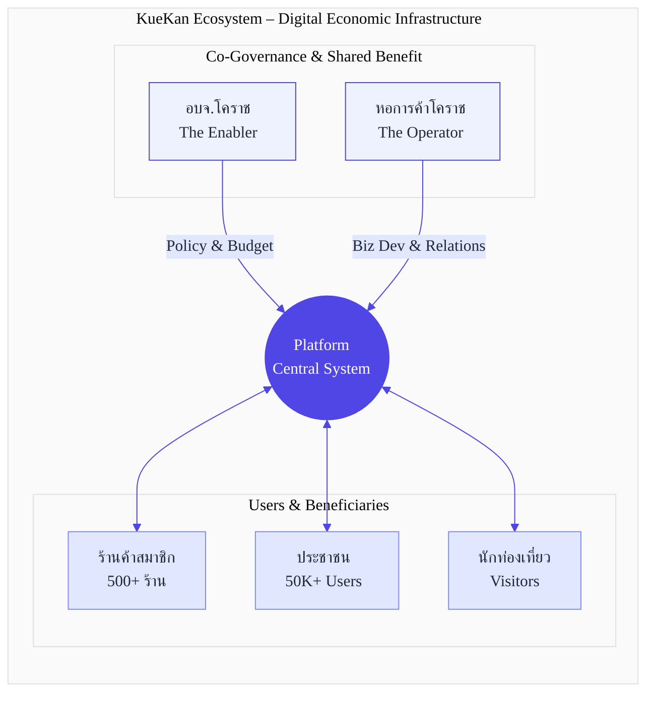
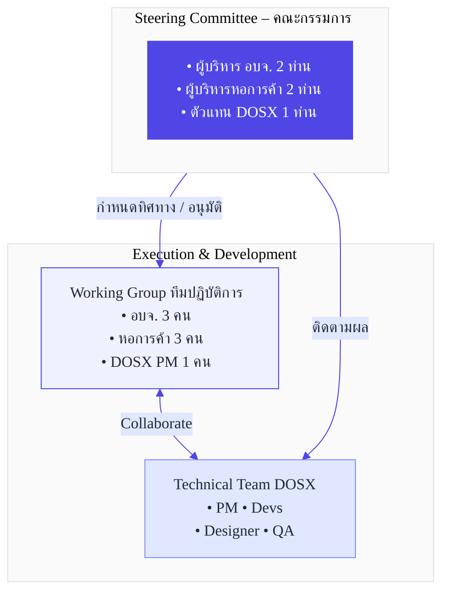
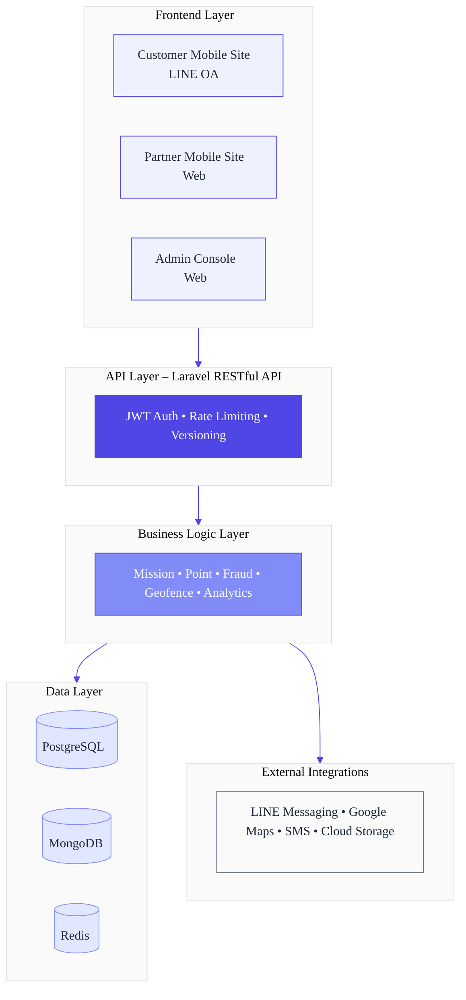
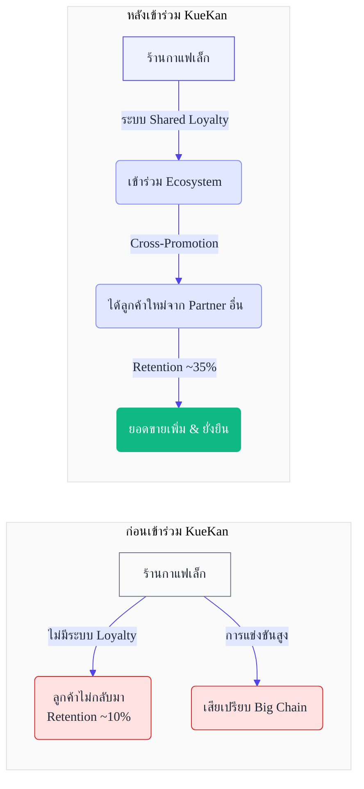
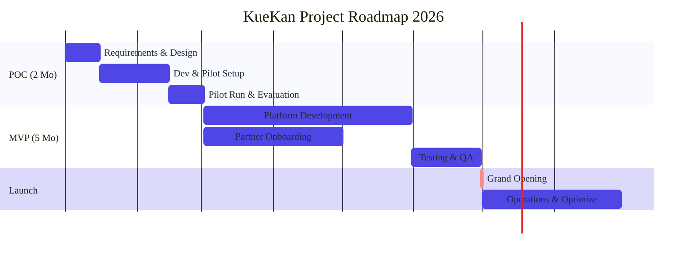

# ข้อเสนอโครงการความร่วมมือ KueKan (คือกัน)

## โครงการพัฒนาโครงสร้างพื้นฐานดิจิทัลทางเศรษฐกิจ จังหวัดนครราชสีมา

**เสนอต่อ:** องค์การบริหารส่วนจังหวัดนครราชสีมา และหอการค้าจังหวัดนครราชสีมา

**จัดทำโดย:** Digitalmedia Outsource Solution Co., Ltd. (DOSX)

**วันที่:** 2 มกราคม 2026

**เวอร์ชัน:** 2.0 (Revised - Data Validation Complete)

---

## สารบัญ

1. บทสรุปผู้บริหาร
2. สถานการณ์และโอกาส
3. วิสัยทัศน์และเป้าหมายของโครงการ
4. รูปแบบความร่วมมือ
5. โซลูชันและสถาปัตยกรรม
6. ประโยชน์สำหรับผู้มีส่วนได้ส่วนเสีย
7. แผนการดำเนินงาน
8. งบประมาณและผลตอบแทน 
9. การวัดผลและ KPIs
10. การบริหารความเสี่ยง
11. ข้อเสนอแนะและขั้นตอนถัดไป
12. ภาคผนวก (Appendix)
13. บทสรุป
14. แหล่งอ้างอิงข้อมูล (References)

---

## 1. บทสรุปผู้บริหาร

### สถานการณ์

จังหวัดนครราชสีมามีศักยภาพทางเศรษฐกิจสูง เป็นศูนย์กลางการค้าของภาคตะวันออกเฉียงเหนือ และมีเป้าหมายสู่การเป็นเมืองอัจฉริยะ (Smart City) แต่การขับเคลื่อนเศรษฐกิจยังขาดเครื่องมือดิจิทัลที่เชื่อมโยงทุกภาคส่วนเข้าด้วยกัน ทั้ง:

- **ภาครัฐ (อบจ.นครราชสีมา):** ต้องการเครื่องมือกระตุ้นการท่องเที่ยว ส่งเสริมสุขภาพประชาชน และวัดผลนโยบายได้อย่างเป็นรูปธรรม
- **ภาคเอกชน (หอการค้าโคราช):** สมาชิก SMEs ต้องการระบบ Shared Loyalty CRM ร่วมกัน เพื่อเพิ่มอำนาจต่อรองและลดต้นทุนการพัฒนาเทคโนโลยี
- **ประชาชนและผู้ประกอบการ:** ต้องการแรงจูงใจในการใช้บริการท้องถิ่น และช่องทางการเข้าถึงสิทธิประโยชน์อย่างเท่าเทียม

### ปัญหาและข้อจำกัด

1. **การแยกส่วนของข้อมูล (Data Fragmentation):** ข้อมูลพฤติกรรมผู้บริโภคกระจัดกระจายอยู่ในแต่ละหน่วยงาน ไม่สามารถนำมาวิเคราะห์เชิงบูรณาการได้
2. **ต้นทุนสูงสำหรับ SMEs:** ร้านค้าขนาดเล็กไม่มีทรัพยากรในการพัฒนาระบบ Digital Loyalty ของตัวเอง (ลงทุนเฉลี่ย 500,000–2,000,000 บาทต่อระบบ)
3. **ขาดเครื่องมือวัดผล (Lack of Measurability):** โครงการส่งเสริมต่างๆ ไม่สามารถติดตามผลลัพธ์ได้อย่างแม่นยำ ทำให้การจัดสรรงบประมาณไม่มีประสิทธิภาพ
4. **Digital Divide:** ผู้ประกอบการในต่างอำเภอขาดความรู้และเครื่องมือในการใช้เทคโนโลยี

### การแก้ปัญหา

**KueKan (คือกัน)** คือ **โครงสร้างพื้นฐานดิจิทัลทางเศรษฐกิจ (Digital Economic Infrastructure)** ที่ออกแบบมาเพื่อเป็นแพลตฟอร์มกลางในการเชื่อมโยงทุกภาคส่วนในจังหวัดนครราชสีมา โดย:

- **สำหรับ อบจ.นครราชสีมา:** เป็นเครื่องมือวัดผลนโยบาย กระตุ้นการท่องเที่ยว และส่งเสริมพฤติกรรมเชิงบวก พร้อมข้อมูล Real-time Dashboard
- **สำหรับหอการค้าโคราช:** เป็นระบบ Shared Loyalty CRM ให้สมาชิก SMEs สามารถแข่งขันได้เทียบเท่าธุรกิจขนาดใหญ่
- **สำหรับประชาชนและนักท่องเที่ยว:** เป็นช่องทางรับสิทธิประโยชน์และสะสมรางวัลผ่านกิจกรรมที่สร้างคุณค่า (Value‑Based Activities)

### ข้อเสนอหลัก

**การร่วมมือระหว่าง อบจ.นครราชสีมา และหอการค้าโคราช ในการพัฒนาแพลตฟอร์ม KueKan** จะสร้างมูลค่าทางเศรษฐกิจและสังคม ดังนี้:

| ประเด็น | รายละเอียด |
| --- | --- |
| ระยะเวลา Phase 1–2 | 6–9 เดือน (POC 2 เดือน + MVP 4–6 เดือน) |
| งบประมาณรวม | 4,000,000–6,000,000 บาท (แบ่งตามสัดส่วนการใช้งาน) |
| ผลตอบแทนที่คาดหวัง | Year 1 ROI: 300–400%, Year 2 ROI: 800–1,200% จากการสร้างมูลค่าเพิ่มสุทธิให้ร้านค้าสมาชิกและเศรษฐกิจท่องเที่ยว |
| Payback Period | 4–6 เดือน (สอดคล้องกับ Industry Standard สำหรับ Loyalty Platform) |
| จำนวนผู้ใช้เป้าหมาย | 30,000–35,000 ผู้ใช้ในปีแรก (ประมาณ 6–7% ของประชากรในเมือง) |
| ร้านค้าพันธมิตร | 500+ ร้านค้า (จากสมาชิกหอการค้าและ OTOP) |

---

## 2. สถานการณ์และโอกาส

### 2.1 การวิเคราะห์ตลาดนครราชสีมา

### ก) ขนาดตลาด

- **ประชากรทั้งจังหวัด:** ประมาณ 2.7 ล้านคน (อันดับ 3 ของประเทศ) [¹]
- **ประชากรในเขตเมือง:** ประมาณ 500,000 คน (กลุ่มเป้าหมายหลัก) [¹]
- **นักท่องเที่ยวต่อปี:** 6–8 ล้านคน (ข้อมูลปี 2562 ก่อน COVID, ปัจจุบันอยู่ในช่วงฟื้นตัว) [²]
- **มูลค่าเศรษฐกิจท่องเที่ยว:** 25,000–30,000 ล้านบาทต่อปี (ปี 2562) [²]

### ข) โอกาสทางเศรษฐกิจ

**การเติบโตของตลาด Loyalty Program ในไทย:**

- มูลค่าตลาด Loyalty Program ในไทยประมาณ 40,000–50,000 ล้านบาท เติบโต 12–15% ต่อปี [³]
- 75–80% ของผู้บริโภคไทยเข้าร่วมโปรแกรม Loyalty อย่างน้อย 1 โปรแกรม [³]
- การใช้งาน Digital Wallet และ LINE เติบโต 30–40% ต่อปี (YoY) [⁴]

**ความต้องการของภาครัฐในการใช้ Data‑Driven Policy:**

- งบประมาณ Digital Transformation ของ อปท. มีแนวโน้มเพิ่มขึ้นตามนโยบาย Digital Thailand และ Smart City [⁵]
- ความต้องการเครื่องมือวัดผล Smart City KPIs เพิ่มสูงขึ้นอย่างต่อเนื่อง

### 2.2 ความสอดคล้องกับยุทธศาสตร์ทั้งสององค์กร

### อบจ.นครราชสีมา: ยุทธศาสตร์ 2567–2572

| ยุทธศาสตร์ | โอกาสจาก KueKan |
| --- | --- |
| 1. พัฒนาเศรษฐกิจ (Tourism & Soft Power) | กระตุ้นการท่องเที่ยวผ่าน Gamified Check‑in ณ สถานที่สำคัญครบทั้ง 32 อำเภอ |
| 2. พัฒนาคุณภาพชีวิต (Smart People) | ส่งเสริมกิจกรรมสุขภาพและจิตอาสาผ่านระบบภารกิจดิจิทัล |
| 3. Smart City Development | ระบบ Big Data Dashboard เพื่อการตัดสินใจเชิงนโยบายอย่างมีข้อมูลรองรับ (Data‑Driven Policy Making) |
| 4. เศรษฐกิจฐานราก (OTOP & Community) | ช่วย SMEs และ OTOP เข้าถึงระบบ Digital Loyalty ได้ง่าย ผ่านแพลตฟอร์มกลาง |

### หอการค้าจังหวัดนครราชสีมา: ยุทธศาสตร์ 2568–2569

| ยุทธศาสตร์ | โอกาสจาก KueKan |
| --- | --- |
| 1. สร้างประโยชน์ให้สมาชิก | ระบบ Shared Loyalty CRM ลดต้นทุนการพัฒนาเทคโนโลยีจาก 500,000–2,000,000 บาท เหลือ 0 บาทสำหรับสมาชิก |
| 2. Korat Mega Sale | Event Gamification Engine ช่วยเพิ่ม Engagement และ Cross‑Promotion ให้แคมเปญส่วนลดทั้งเมือง |
| 3. ยกระดับเศรษฐกิจ 32 อำเภอ | Mobile‑First Design ทำให้ร้านค้าต่างอำเภอเข้าร่วมแพลตฟอร์มได้ง่าย |
| 4. Korat Wellness & MICE Tourism | ระบบ Digital Privilege Passport สำหรับนักท่องเที่ยว MICE และกลุ่ม Wellness |

---

## 3. วิสัยทัศน์และเป้าหมายของโครงการ

### 3.1 วิสัยทัศน์

> “ทำให้นครราชสีมาเป็นจังหวัดแรกในภาคตะวันออกเฉียงเหนือที่มีระบบนิเวศดิจิทัลทางเศรษฐกิจแบบบูรณาการ ที่เชื่อมโยงภาครัฐ ภาคเอกชน และประชาชนเข้าด้วยกัน เพื่อสร้างการเติบโตทางเศรษฐกิจอย่างยั่งยืนและเท่าเทียม”
> 

### 3.2 เป้าหมายหลัก

| Objective | Specific | Measurable | Achievable | Time‑bound |
| --- | --- | --- | --- | --- |
| O1: เพิ่มยอดขายให้ร้านค้าสมาชิก | เพิ่มยอดขายเฉลี่ยต่อร้าน | 20–30% | ใช้ Cross‑Promotion และ Gamification | ภายใน 12 เดือนหลัง Launch |
| O2: กระตุ้นการท่องเที่ยว | เพิ่มจำนวนนักท่องเที่ยวไปยังแหล่งท่องเที่ยวรอง | 15–25% | ใช้ Check‑in Missions | ภายใน 18 เดือน |
| O3: สร้าง Data Infrastructure | เก็บข้อมูลพฤติกรรมผู้ใช้ | 30,000+ Users พร้อม Transaction Data | Platform รองรับการขยายตัว | เริ่มเก็บข้อมูลตั้งแต่เดือนแรก |
| O4: ลดช่องว่างทางดิจิทัล | เพิ่มจำนวนร้านค้าที่ใช้เทคโนโลยี | 500+ ร้านค้าในระบบ | LINE‑First Approach ใช้งานง่าย | ช่วยยกระดับ SMEs | ภายใน 24 เดือน |

### 3.3 เป้าหมายรอง

1. **สร้างวัฒนธรรมสุขภาพ:** มีผู้เข้าร่วมกิจกรรมสุขภาพผ่าน KueKan อย่างน้อย 10,000 คนต่อปี
2. **ส่งเสริมสินค้า OTOP:** เพิ่มช่องทางจำหน่ายสินค้า OTOP ผ่านระบบแลกรางวัล
3. **สร้าง Korat Brand Loyalty:** ทำให้ KueKan กลายเป็นสุดยอดแอปพลิเคชัน (Super App) ประจำจังหวัดที่ประชาชนใช้งานประจำ (ผู้ใช้งานรายวัน ≥ 20%)

---

## 4. รูปแบบความร่วมมือ

### 4.1 โครงสร้างความร่วมมือแบบ Public‑Private Partnership

### แบบจำลองการร่วมมือ

### 4.2 บทบาทและความรับผิดชอบ

### A) องค์การบริหารส่วนจังหวัดนครราชสีมา (ผู้สนับสนุนและเจ้าภาพด้านนโยบาย)

| ด้าน | ความรับผิดชอบ | ผลลัพธ์ที่คาดหวัง |
| --- | --- | --- |
| ด้านงบประมาณ | สนับสนุนงบประมาณพัฒนาระบบในส่วน Public Interest (ประมาณ 40–50% ของงบรวม) | งบประมาณ 2.0–2.5 ล้านบาท |
| ด้านนโยบาย | กำหนดนโยบายและแนวทาง Smart City Integration | นโยบายการใช้งาน KueKan ในโครงการต่างๆ ของ อบจ. |
| ด้านการตลาด | ประชาสัมพันธ์แพลตฟอร์มให้เป็น “แอปประจำจังหวัด” | 30,000–35,000 Users ภายใน 12 เดือน |
| ด้านข้อมูล | เข้าถึง Dashboard เพื่อวิเคราะห์นโยบายและวัดผล KPIs | การกำหนดนโยบายแบบขับเคลื่อนด้วยข้อมูล |
| ด้านรางวัล | จัดหาของรางวัลที่เป็นสินค้าท้องถิ่น/OTOP หรือบริการสาธารณะ | รายการของรางวัล ≥ 100 รายการ |

### B) หอการค้าจังหวัดนครราชสีมา (ผู้ดำเนินงานและผู้สนับสนุนทางธุรกิจ)

| ด้าน | ความรับผิดชอบ | ผลลัพธ์ที่คาดหวัง |
| --- | --- | --- |
| ด้านงบประมาณ | สนับสนุนงบประมาณในส่วน Business Development (ประมาณ 50–60% ของงบรวม) | งบประมาณ 2.0–3.5 ล้านบาท |
| ด้าน Onboarding | เชิญชวนสมาชิกร้านค้าเข้าร่วมเป็น Partner ในระบบ | 500+ ร้านค้าในปีแรก |
| ด้านการดำเนินงาน | บริหารจัดการ Partner Relations และ Customer Support | คะแนนความพึงพอใจพันธมิตร ≥ 80% |
| ด้าน Privilege | ประสานงานธุรกิจขนาดใหญ่เพื่อมอบ Exclusive Rewards | รายการของรางวัลสำหรับกลุ่ม VIP Tier |
| ด้าน Innovation | ให้กลุ่ม YEC เป็น Innovation Lab ทดลองฟีเจอร์ใหม่ | Beta Testing Group ≥ 50 คน |

### C) DOSX (พันธมิตรด้านเทคโนโลยีและผู้รวบรวมระบบ)

| ด้าน | ความรับผิดชอบ | ผลลัพธ์ที่คาดหวัง |
| --- | --- | --- |
| ด้านพัฒนา | พัฒนาและส่งมอบระบบตามแผน (POC + MVP) | ระบบที่ใช้งานได้จริง ครบถ้วนตาม Feature ที่ตกลง |
| ด้านบำรุงรักษา | ดูแลระบบ ซ่อมแซม และอัปเดต (ปีแรกฟรี) | ความพร้อมใช้งานของระบบ ≥ 99% |
| ด้านฝึกอบรม | อบรมทีมงาน อบจ. และหอการค้าในการใช้งาน Admin Console | ผู้ใช้งานที่ผ่านการรับรอง ≥ 20 คน |
| ด้านที่ปรึกษา | ให้คำปรึกษาด้าน Gamification และ Customer Engagement | ทบทวนกลยุทธ์รายไตรมาสต่อเนื่อง |

### 4.3 โครงสร้างการบริหารโครงการ

**การประชุม:**

- Steering Committee: ประชุมทุก 2 เดือน (Review Progress & Decision Making)
- Working Group: ประชุมทุกสัปดาห์ (Operational Execution)
- Technical Team: Daily Standup (Agile Development)

### 4.4 โมเดลการแบ่งผลประโยชน์

### การจัดสรรผลประโยชน์จาก Platform (Revenue / Impact Sharing)

| ประเภทผลประโยชน์ | อบจ. | หอการค้า | DOSX | หมายเหตุ |
| --- | --- | --- | --- | --- |
| Data Insights | 100% | 60% | 0% | อบจ. ได้ Full Access, หอการค้าได้เฉพาะส่วน Business |
| Brand Value | 50% | 50% | 0% | Co‑Branding ระหว่าง อบจ. และหอการค้า |
| Future Revenue (ถ้ามี) | 30% | 50% | 20% | รายได้จาก Sponsorship / Ads หลังปีที่ 2 |
| Platform Ownership | 40% | 40% | 20% | Equity Structure (กรณีจัดตั้ง Entity ใหม่ร่วมกัน) |

---

## 5. โซลูชันและสถาปัตยกรรม

### 5.1 ภาพรวมของแพลตฟอร์ม

**KueKan (คือกัน)** เป็น **Loyalty & Rewards Platform with Gamification** ที่ออกแบบมาเพื่อ:

1. **Engagement:** ใช้กลไก Gamification ดึงดูดให้ผู้ใช้เข้าร่วมกิจกรรมที่สร้างคุณค่าให้เมืองและชุมชน
2. **Retention:** ให้ผู้ใช้สะสมแต้มและแลกรางวัล เพื่อสร้าง Local Loyalty กับร้านค้าและบริการในจังหวัด
3. **Data Collection:** เก็บข้อมูลพฤติกรรมผู้ใช้และการใช้จ่าย เพื่อการวิเคราะห์เชิงลึกและการตัดสินใจเชิงนโยบาย
4. **Economic Circulation:** ทำให้เม็ดเงินหมุนเวียนภายในจังหวัด (Local Economy) มากที่สุด

### 5.2 ส่วนประกอบหลักของระบบ

### A) เว็บแอปสำหรับผู้ใช้ทั่วไป (Customer Mobile Site)

**แนวคิด:** LINE‑First Approach – ผู้ใช้เข้าถึงผ่าน LINE Official Account โดยไม่ต้องดาวน์โหลดแอปใหม่

**ฟีเจอร์หลัก:**

1. **KueKan Pocket (กระเป๋าแต้มรางวัล)**
    - กระเป๋าแต้มกลางที่เก็บแต้มจากทุกภารกิจและร้านค้า
    - แสดงยอดคงเหลือ ประวัติ และมูลค่าแต้มแบบ Real‑time
    - รองรับการโอนแต้มระหว่างโปรแกรมในอนาคต
2. **Mission Center (ศูนย์ภารกิจ)**
    - **Location‑Based Missions:** Check‑in ที่สถานที่ท่องเที่ยวหรือร้านค้า (ใช้ Geofencing)
    - **Purchase‑Based Missions:** ทำยอดใช้จ่ายครบตามเกณฑ์ที่กำหนด
    - **Action‑Based Missions:** เข้าร่วมกิจกรรมสุขภาพ / จิตอาสา
    - **Time‑Based Missions:** กิจกรรมพิเศษตามเทศกาลหรือ Event เฉพาะช่วงเวลา
3. **Reward Redemption (ระบบแลกรางวัล)**
    - Catalog ของรางวัล เช่น สินค้า OTOP, Voucher ร้านค้า, บริการสาธารณะ
    - Digital Coupon พร้อม QR Code สำหรับใช้หน้างาน
    - แผนที่ (Map View) ค้นหาร้านค้าที่ร่วมรายการแลกแต้ม
4. **Tiering System (ระบบระดับสมาชิก)**
    - ระดับ Standard (สมาชิกทั่วไป)
    - ระดับ Exclusive / VIP (ได้รับสิทธิ์พิเศษและแต้มคูณเพิ่ม)
    - ระบบ Auto‑Upgrade ตามแต้มสะสมและพฤติกรรมใช้งาน

### B) เว็บแอปสำหรับร้านค้า (Partner Mobile Site)

**แนวคิด:** อินเทอร์เฟซเรียบง่าย ใช้งานได้ทันที ลดภาระการฝึกอบรม

**ฟีเจอร์หลัก:**

1. **Hybrid QR Scanner**
    - ใช้ QR เดียวรองรับทั้งการ “ให้แต้ม” และ “แลกของรางวัล”
    - ลดความสับสนของพนักงานหน้าร้าน และเพิ่มความเร็วการให้บริการ
2. **Manual Point Award**
    - ร้านค้ากดให้แต้มเมื่อยอดซื้อครบเกณฑ์ (เช่น ซื้อครบ 500 บาท ได้ 50 Points)
    - ระบบบันทึกประวัติอัตโนมัติ รองรับการตรวจสอบย้อนหลัง
3. **Partner Dashboard**
    - รายงานยอดลูกค้าและธุรกรรมรายวัน/รายเดือน
    - ภารกิจที่ลูกค้านิยมทำที่ร้าน (Top Missions)
    - รองรับการ Export รายงานเป็นไฟล์ Excel

### C) ระบบจัดการหลังบ้าน (Admin Console)

**แนวคิด:** Command Center สำหรับบริหาร Ecosystem ทั้งหมดของจังหวัด

**ฟีเจอร์สำคัญสำหรับ อบจ. และหอการค้า:**

1. **Real‑Time Dashboard**
    
    <aside>

    **ตัวอย่าง KPIs Dashboard Snapshot:**
    
    Active Users: 12,458 (↑ 23% จากเดือนก่อน)
    
    Points in Circulation: 1.2M Points
    
    Redemption Rate: 68%
    
    Partner Performance: แสดง Top 10 Stores
    
    User Journey: วิเคราะห์ Top Visited Locations
    
    </aside>
    
2. **Mission Management**
    - สร้างภารกิจใหม่สำหรับแคมเปญต่างๆ เช่น “เที่ยวโคราช 32 อำเภอ”
    - ตั้งค่าเงื่อนไข ระยะเวลา และรางวัลได้อย่างยืดหยุ่น
    - ติดตามผลสำเร็จของแต่ละภารกิจแบบ Real‑time
3. **Geofence Manager** 
    - วาดพื้นที่กิจกรรมบนแผนที่ (รองรับ Multi‑Polygon)
    - Import KML จาก Google Maps
    - ทดสอบตำแหน่งก่อนเปิดใช้งานจริง เพื่อลด False Positive
4. **Fraud Detection**
    - แจ้งเตือนเมื่อพบพฤติกรรมผิดปกติ เช่น Check‑in ซ้ำจำนวนมากในเวลาสั้นๆ
    - ระบบ Blacklist ผู้ใช้หรือร้านค้าที่ผิดกติกา
    - Audit Log บันทึกทุกการกระทำในระบบ
5. **Analytics & Reporting**
    - Custom Report Builder สำหรับทีมยุทธศาสตร์
    - Cohort Analysis เปรียบเทียบกลุ่มผู้ใช้ตามช่วงเวลาและพฤติกรรม
    - ROI Calculator สำหรับประเมินผลตอบแทนของแต่ละแคมเปญ

### 5.3 สถาปัตยกรรมทางเทคนิค

**Technology Stack:**

- **Backend:** Laravel 10+ (PHP 8.2+)
- **Databases:** PostgreSQL (Primary), MongoDB (Logs), Redis (Cache)
- **Cloud:** Google Cloud Platform (Compute Engine, Cloud Storage, Load Balancer)
- **Frontend:** Responsive Web (HTML5, TailwindCSS, Vue.js)
- **Mobile:** LINE LIFF (LINE Frontend Framework)
- **DevOps:** CI/CD Pipeline, Docker, Kubernetes

### 5.4 ความแตกต่างจากคู่แข่ง

| ประเด็น | KueKan | Loyalty Apps ทั่วไป (เช่น TRUE, ดีแทค) |
| --- | --- | --- |
| ขอบเขตการใช้งาน | ทั้งจังหวัด (Multi‑Merchant & Multi‑Sector) | จำกัดเฉพาะแบรนด์ของตัวเอง |
| การเข้าถึง | ผ่าน LINE – ไม่ต้องดาวน์โหลดแอปใหม่ | ต้องดาวน์โหลดและติดตั้งแอป |
| กลุ่มเป้าหมาย | SMEs, ร้านท้องถิ่น, ประชาชนทั่วไป และนักท่องเที่ยว | ลูกค้าของแบรนด์เท่านั้น |
| วัตถุประสงค์ | เน้น Economic & Social Impact ระดับจังหวัด | เน้น Commercial Impact ของบริษัทเอกชน |
| กรรมสิทธิ์ข้อมูล | อบจ. และหอการค้า ถือครองในมุม Public Good | เป็นของเอกชน 100% |
| ความยืดหยุ่น | ปรับรูปแบบตามนโยบายท้องถิ่นและบริบทจังหวัด | ฟังก์ชันถูกกำหนดโดยแบรนด์ระดับประเทศ |

---

## 6. ประโยชน์สำหรับผู้มีส่วนได้ส่วนเสีย

### 6.1 ประโยชน์สำหรับองค์การบริหารส่วนจังหวัดนครราชสีมา

### ก) วัดผลความสำเร็จโครงการได้จริง

**ปัญหาเดิม:** โครงการท่องเที่ยวหรือโครงการส่งเสริมสุขภาพมักวัดผลได้เพียง “จำนวนคนมางาน” แต่ไม่ทราบว่า:

- มาจากไหน (คนท้องถิ่นหรือนักท่องเที่ยว)
- ใช้จ่ายเท่าไร ที่ร้านค้าหรือสถานที่ใด
- กลับมาใช้บริการซ้ำหรือไม่

**Solution จาก KueKan:**

- Dashboard แสดง **User Journey Map:** เห็นเส้นทางว่าผู้เข้าร่วมกิจกรรมไปที่ไหนต่อ
- **Heat Map:** พื้นที่หรือสถานที่ที่มี Check‑in สูงที่สุด
- **Conversion Tracking:** จำนวนผู้เข้างานเทียบกับผู้ที่เกิดการใช้จ่ายจริง (Redemption Rate)
- **Retention Rate:** วัดอัตราการกลับมาใช้บริการซ้ำภายในช่วงเวลาที่กำหนด

<aside>

**ตัวอย่าง Dashboard:**

Campaign Dashboard: “เที่ยวโคราช 32 อำเภอ”

Total Check‑ins: 8,450 ครั้ง

Unique Users: 3,200 คน

Most Popular Location: อุทยานธรณีโคราช (1,245 Check‑ins)

Average Spending per User: 850 บาท

Return Rate: 42% (กลับมาเที่ยวซ้ำภายใน 30 วัน)

</aside>

### ข) ภาพลักษณ์เมืองอัจฉริยะ

- ใช้ KueKan เป็น Showcase ในงาน Smart City Thailand เพื่อดึงดูดนักลงทุน
- สร้างความเชื่อมั่นให้ประชาชนในการใช้เทคโนโลยีของภาครัฐ
- สอดคล้องและสนับสนุนนโยบายของกระทรวง DE/MDES ด้าน Digital Economy & Smart City

### ค) การกระจายรายได้สู่ชุมชน

**กลไก:** ออกแบบรางวัลให้แลกได้เฉพาะที่ร้านค้าชุมชนหรือร้าน OTOP

- ตัวอย่าง: ใช้ 100 Points แลกคูปอง 50 บาท ที่ร้าน OTOP ในตลาดโคราช
- ทำให้เงินหมุนเวียนกลับสู่ฐานรากและเศรษฐกิจชุมชน

**Impact ที่คาดหวัง:**

- เพิ่มรายได้ให้ร้าน OTOP เฉลี่ย 15–20% ในปีแรก
- ลดการรั่วไหลของเม็ดเงินออกนอกจังหวัดอย่างมีนัยสำคัญ

### ง) ช่องทางสื่อสารทางตรง

- ส่งข้อความแจ้งเตือนภัยพิบัติผ่าน LINE Push ถึงประชาชน ≥ 30,000 คนได้ทันที
- ประชาสัมพันธ์นโยบายหรือโครงการใหม่เชิงเจาะจงกลุ่มเป้าหมาย
- ทำแบบสำรวจความคิดเห็นประชาชนแบบ Real‑time (Digital Town Hall)

### 6.2 ประโยชน์สำหรับหอการค้าจังหวัดนครราชสีมา

### ก) ข้อมูลและอำนาจต่อรอง

**สถานะปัจจุบัน:** หอการค้ายังไม่มีฐานข้อมูลพฤติกรรมผู้บริโภคในจังหวัดเชิงลึก

**หลังใช้ KueKan:**

- มีข้อมูลผู้ใช้ ≥ 30,000 ราย พร้อม Transaction Data
- วิเคราะห์ได้ว่า:
    - หมวดสินค้าใดขายดีที่สุด (Category Analysis)
    - เวลาใดเป็น Peak Hours ในการใช้จ่าย
    - กลุ่มอายุใดมีค่าใช้จ่ายเฉลี่ยสูงสุด (Demographic Insights)

**Use Case:**

- ใช้ข้อมูลจริงต่อรองกับห้างสรรพสินค้ารายใหญ่เพื่อจัด “Korat Week” หรือแคมเปญร่วม
- นำเสนอข้อเสนอเชิงนโยบายต่อภาครัฐด้วยฐานข้อมูลจริง (Data‑Driven Policy Advocacy)

### ข) เครื่องมือที่จับต้องได้สำหรับสมาชิก

**ก่อนมี KueKan:**

- สมาชิกหอการค้าต้องลงทุนพัฒนาระบบ Loyalty เอง (500,000–2,000,000 บาทต่อระบบ)
- SMEs ขนาดเล็กไม่มีงบลงทุน ทำให้เสียเปรียบเมื่อเทียบกับแบรนด์ใหญ่

**หลังมี KueKan:**

- สมาชิกหอการค้าทุกรายสามารถใช้ Shared Loyalty System ร่วมกัน ฟรี หรือมีค่าใช้จ่ายต่อหน่วยต่ำมาก
- ประหยัดต้นทุน 100% และได้ประโยชน์จาก Network Effect – ยิ่งมีร้านเข้าร่วมมาก ลูกค้ายิ่งอยากใช้ระบบ

**ตัวอย่าง Case:**

### ค) Cross‑Promotion Automation

**กลไก:** ระบบออกแบบภารกิจให้ลูกค้าเคลื่อนที่ไปใช้จ่ายหลายร้านใน Ecosystem โดยอัตโนมัติ

<aside>

**ตัวอย่าง Mission Chain:**

1. กินข้าวที่ร้าน A → ได้ 50 Points + คูปองส่วนลด 20% ร้าน B
2. ซื้อสินค้าแฟชั่นที่ร้าน B → ได้ 80 Points + คูปองร้านกาแฟ C
3. ดื่มกาแฟที่ร้าน C → ได้ 30 Points + สิทธิ์ลุ้นรางวัลใหญ่ของจังหวัด
</aside>

**Impact:**

- เพิ่มยอดขายเฉลี่ยของร้านสมาชิก 20–30% (อิงจากโครงการลักษณะคล้ายกันในต่างประเทศ)
- เพิ่ม Basket Size ต่อการใช้จ่ายต่อครั้งเฉลี่ย ~40%

### ง) ดึงดูดสมาชิกใหม่

- ใช้ KueKan เป็น “Member Benefit หลัก” ในการเชิญผู้ประกอบการรุ่นใหม่เข้าร่วมเป็นสมาชิกหอการค้า
- แนวคิด: “สมัครหอการค้า = ได้ใช้ KueKan ฟรี + เข้าถึงลูกค้า 30,000+ คน”

### 6.3 ประโยชน์สำหรับร้านค้า / SMEs (Partner Merchants)

| ด้าน | ก่อน KueKan | หลัง KueKan |
| --- | --- | --- |
| Customer Retention | 10–15% | 30–40% (เพิ่ม ~3 เท่า) |
| Data Insights | แทบไม่มีข้อมูล | Dashboard แสดงพฤติกรรมลูกค้าแบบ Real‑time |
| Marketing Cost | 5–10% ของรายได้ | ลดลง ~50% จากการใช้ Platform กลางร่วมกัน |
| New Customer Acquisition | พึ่งพาปากต่อปากเป็นหลัก | เข้าถึงลูกค้าจากทั้ง Network ของแพลตฟอร์ม |
| Technology Cost | 500K–2M บาท หากพัฒนาระบบเอง | 0 บาท (ใช้ Shared Platform) |

### 6.4 ประโยชน์สำหรับประชาชนและนักท่องเที่ยว

### ก) ประชาชนจังหวัดนครราชสีมา

- **แรงจูงใจใช้บริการท้องถิ่น:** ได้แต้มทุกครั้งที่ใช้จ่ายในร้านค้าท้องถิ่น
- **สิทธิประโยชน์ที่เท่าเทียม:** ทุกคนเข้าถึงได้ผ่าน LINE ไม่จำเป็นต้องมีบัตรเครดิตหรือสมาร์ตโฟนระดับสูง
- **ส่งเสริมสุขภาพและสังคม:** ได้แต้มจากการออกกำลังกาย เข้าร่วมกิจกรรมจิตอาสา และกิจกรรมเพื่อชุมชน

### ข) นักท่องเที่ยว

- **Digital Passport:** สะสมแต้มจากการท่องเที่ยวครบทุกโซนในโคราช
- **Exclusive Rewards:** แลกรับของที่ระลึกหรือส่วนลดพิเศษจากร้านค้าท้องถิ่น
- **ความสะดวกสบาย:** ไม่ต้องพกบัตรสะสมแต้มหลายใบ รวมทุกสิทธิ์ไว้ใน LINE เพียงช่องทางเดียว

---

## 7. แผนการดำเนินงาน

### 7.1 ภาพรวมการดำเนินงาน

<aside>

**Timeline:** 9 เดือน (36 สัปดาห์)
Month 1–2: POC (Proof of Concept)
Month 3–8: MVP (Minimum Viable Product)
Month 9: Launch & Early Operations

</aside>

### 7.2 Phase 1: POC (Proof of Concept) – 8 สัปดาห์

**เป้าหมาย:** พิสูจน์ว่าระบบสามารถใช้งานได้จริงและมี Product‑Market Fit

**Scope:**

| สัปดาห์ | กิจกรรม | Deliverables |
| --- | --- | --- |
| W1–W2 | Kick‑off Meeting, Requirements Workshop, Design Sprint | Project Charter, Detailed Requirements, Wireframes |
| W3–W5 | Core Development, LINE Integration, Basic Geofencing | Customer Site (ล็อกอิน, เช็คอิน, ดูแต้ม), Partner Site (สแกน QR), Admin (สร้างภารกิจพื้นฐาน) |
| W6–W7 | Integration Testing, Pilot Program | ทดสอบกับ 3–5 ร้านค้า, 100 Users Beta |
| W8 | Review & Feedback, Go/No‑Go Decision | POC Report, ข้อเสนอแนะสำหรับการต่อยอดเป็น MVP |

**Pilot Program – “Korat Creative Splash 2026”**

- เลือก 1 งานหลักของ อบจ. หรือหอการค้าเป็นพื้นที่ทดลองระบบ
- ทดลองใช้ระบบ Check‑in และการแจกแต้มในงานจริง
- วัดผล: จำนวนผู้เข้าร่วม, Satisfaction Score, ปัญหาเชิงเทคนิคที่ต้องปรับปรุง

**งบประมาณ Phase 1:** 1,000,000 บาท

### 7.3 Phase 2: MVP (Minimum Viable Product) – 20 สัปดาห์

**เป้าหมาย:** พัฒนาระบบแบบเต็มรูปแบบพร้อมใช้งานเชิงพาณิชย์และสาธารณะ

### A) Platform Development (12 สัปดาห์)

| Module | Features | Timeline |
| --- | --- | --- |
| Customer Site | ภารกิจทุกประเภท (Location, Purchase, Action, Time‑based), Reward Catalog + Digital Coupon, Tiering System, รองรับหลายภาษา | W1–W8 |
| Partner Site | การให้แต้มและแลกคูปอง, Dashboard และรายงาน, Manual Verification | W1–W6 |
| Admin Console | Real‑time Dashboard, Geofence Manager, Fraud Detection, Analytics & Reporting | W1–W10 |
| Backend | Full API, Database Optimization, Cloud Deployment (GCP), Security Hardening | W1–W12 |

### B) Content & Operations Setup (8 สัปดาห์)

| กิจกรรม | เป้าหมาย | ผู้รับผิดชอบ |
| --- | --- | --- |
| Partner Onboarding | 100 ร้านค้าแรก | หอการค้า (Lead) + DOSX (Support) |
| Rewards Catalog | 50+ รางวัล (OTOP, Vouchers, บริการสาธารณะ) | อบจ. (Supply) + หอการค้า (Coordinate) |
| Mission Creation | 20+ Missions พร้อมใช้งานจริง | Working Group |
| Content Production | ภาพ, คำบรรยาย, และวิดีโอแนะนำการใช้งาน | DOSX Design Team |

### C) Testing & Quality Assurance (6 สัปดาห์)

| Type | กิจกรรม | Timeline |
| --- | --- | --- |
| UAT | ทดสอบร่วมกับ Working Group และกลุ่ม YEC | W13–W15 |
| Load Testing | จำลองผู้ใช้ 10,000+ คน พร้อมกัน | W16 |
| Security Audit | Penetration Testing โดย 3rd Party | W17–W18 |
| Beta Launch | เปิดให้ Early Adopters 1,000 คน | W19–W20 |

**งบประมาณ Phase 2:** 3,000,000–5,000,000 บาท

### 7.4 Phase 3: Launch & Iteration (เดือนที่ 9 เป็นต้นไป)

**Go‑to‑Market Strategy**

### Pre‑Launch (2 สัปดาห์ก่อนเปิดตัว)

- แถลงข่าวร่วมกันระหว่าง อบจ. และหอการค้า
- Teaser Campaign บน Social Media และช่องทางชุมชน
- อบรมร้านค้าพันธมิตร 500 ร้าน

### Launch Event

- จัดงาน Grand Opening พร้อม Special Missions
- เป้าหมาย: 5,000 Sign‑ups ในวันแรก
- เชิญสื่อท้องถิ่นและสื่อระดับชาติมาร่วมงาน

### Post‑Launch (3 เดือนแรก)

- **Month 1:** เน้น Awareness (Onboard 20,000 Users)
- **Month 2:** เน้น Engagement (Daily Active Users ≥ 30% ของผู้ลงทะเบียน)
- **Month 3:** เน้น Retention (30‑Day Return Rate ≥ 40%)

<aside>

**ตัวอย่าง Campaign แนะนำ:**

1. **“เที่ยวโคราช 32 อำเภอ” (Tourism):** Check‑in ครบ 10 อำเภอ รับเข็มกลัดพิเศษ + แต้มคูณ 2
    
    Partner: ททท. สำนักงานโคราช, อบจ.
    
2. **“Korat Mega Sale 2026” (Commerce):** ช้อปร้านสมาชิกหอการค้าครบ 3 ร้าน ลุ้นของรางวัลใหญ่
    
    Partner: หอการค้า, ห้างสรรพสินค้าในจังหวัด
    
3. **“โคราชสุขภาพดี” (Health & Wellness):** วิ่ง / ปั่นจักรยานเก็บระยะทาง ได้แต้มตามระยะ
    
    Partner: สำนักงานสาธารณสุขจังหวัด และชมรมกีฬาในพื้นที่
    
</aside>

### 7.5 Roadmap แบบ Visual

---

## 8. งบประมาณและผลตอบแทน

### 8.1 งบประมาณรวม

### A) งบพัฒนาระบบ

| รายการ | POC | MVP | รวม (บาท) | หมายเหตุ |
| --- | --- | --- | --- | --- |
| Platform Development | 600,000 | 2,000,000 | 2,600,000 | Backend + Frontend + Admin |
| Design & UX | 100,000 | 300,000 | 400,000 | UI/UX, Graphic Design |
| Testing & QA | 50,000 | 400,000 | 450,000 | UAT, Load Test, Pen‑test |
| Cloud Infrastructure (Setup) | 50,000 | 200,000 | 250,000 | GCP Setup & Configuration |
| Project Management | 100,000 | 300,000 | 400,000 | PM, Documentation |
| Training & Support | 100,000 | 200,000 | 300,000 | User Manual, Training Sessions |
| **รวมค่าพัฒนา** | **1,000,000** | **3,400,000** | **4,400,000** |  |

### B) งบดำเนินงาน(ปีแรก)

| รายการ | ต่อเดือน (บาท) | ต่อปี (บาท) | หมายเหตุ |
| --- | --- | --- | --- |
| Cloud Hosting (GCP) | 30,000 | 360,000 | Compute, Storage, Bandwidth |
| LINE Messaging API | 10,000 | 120,000 | ขึ้นกับจำนวนข้อความ |
| SMS Gateway (OTP) | 5,000 | 60,000 | ประมาณ 10,000 OTP / เดือน |
| Maintenance & Updates | 40,000 | 480,000 | Bug Fixes, Minor Updates (ปีแรกฟรี รวมใน Development Cost) |
| Customer Support | 25,000 | 300,000 | ทีม Support 2 คน (Part‑time) |
| License & Tools | 10,000 | 120,000 | Sentry, Analytics Tools อื่นๆ |
| **รวมค่าดำเนินงาน (ปีแรก)** | **120,000** | **1,440,000** |  |

> **หมายเหตุ:** ค่า Maintenance ปีแรกฟรี (รวมใน Development Cost แล้ว) ทำให้ค่าใช้จ่ายจริงปีแรกอยู่ที่ประมาณ 960,000 บาท
> 

### C) สรุปงบประมาณทั้งหมด

| รายการ | จำนวน (บาท) |
| --- | --- |
| Development (POC + MVP) | 4,400,000 |
| Operational Cost (ปีแรก) | 960,000 |
| Contingency (10%) | 440,000 |
| **รวมทั้งหมด (ปีแรก)** | **5,800,000** |

> **Recommendation:** จัดงบประมาณรวม 6,000,000 บาท เพื่อเผื่อความปลอดภัยและความยืดหยุ่นในการดำเนินงาน
> 

### 8.2 การแบ่งงบประมาณระหว่างองค์กร

| องค์กร | % | จำนวน (บาท) | เหตุผล |
| --- | --- | --- | --- |
| อบจ.นครราชสีมา | 40–50% | 2,400,000–3,000,000 | ลงทุนในส่วน Public Good (Tourism, Health, Data Infrastructure) |
| หอการค้าโคราช | 50–60% | 3,000,000–3,600,000 | ลงทุนในส่วน Commercial (SME Benefits, Business Data) |

**ทางเลือกทางการเงิน :**

1. **Co‑Investment Model:** แบ่งลงทุนร่วมกันสัดส่วน 50/50
2. **Sponsorship Model:** หาสปอนเซอร์ (เช่น ผู้ประกอบการรายใหญ่) เพื่อช่วยลดภาระงบประมาณ
3. **Phased Investment:** อบจ. สนับสนุนงบ POC ก่อน ส่วนหอการค้าลงทุนเพิ่มในช่วง MVP หลังพิสูจน์ผลแล้ว
4. **Revenue Sharing Model:** ลงทุนร่วมกันตั้งแต่แรก แล้วแบ่งรายได้ในอนาคตจาก Sponsorship / Ads

### 8.3 การคำนวณผลตอบแทน

### A) ผลตอบแทนสำหรับหอการค้า

**Assumptions (Conservative):**

- 500 ร้านค้าสมาชิกเข้าร่วม
- Sales Uplift: 25% (สำหรับลูกค้าที่อยู่ใน Loyalty Program)
- Loyalty Member Penetration: 40% ของลูกค้าทั้งหมด
- รายได้เฉลี่ยต่อร้าน: 500,000 บาท/เดือน
- Net Profit Margin: 15%
- Attribution to Platform: 70% (รับรู้ว่ามีปัจจัยอื่นร่วมด้วย 30%)
- Year 1 Ramp‑up: 30% ของ Full Capacity

**ผลสรุปปีที่ 1:**

- ROI ~ 215%
- Payback Period ~ 3.8 เดือน

> การคำนวณอิง **Net Incremental Profit** ไม่ใช่ Gross Revenue และเน้น Value Creation ให้สมาชิกหอการค้า ไม่ใช่รายได้ของหอการค้าโดยตรง
> 

### B) ผลตอบแทนสำหรับ อบจ.

**Assumptions (Conservative):**

- จำนวนนักท่องเที่ยวไปยังแหล่งรองเพิ่มขึ้น 15–20% จาก Gamification
- Average Spending ต่อ Tourist: 1,200 บาท/คน
- Net Economic Value (หลังหัก Leakage): 30% ของรายจ่าย
- Attribution to Platform: 50%
- Year 1 Ramp‑up: 20% ของ Full Capacity

**ผลสรุปปีที่ 1:**

- Economic Value ~ 16.48 ล้านบาท
- ROI ~ 587%

> ใช้ Net Economic Value เป็นฐาน ไม่ใช่ Gross Tourism Revenue และไม่รวม Data Value ซึ่งมีมูลค่าสูงแต่ประเมินเป็นตัวเลขยาก
> 

### C) ผลตอบแทนรวม

**Year 1 Impact (Conservative Estimates):**

| Stakeholder | Value Type | Year 1 (ล้านบาท) | Year 2 Full Scale (ล้านบาท) |
| --- | --- | --- | --- |
| SMEs (500 ร้าน) | Net Profit Increase | 9.45 | 31.5 |
| อบจ. | Economic Value + Marketing Savings | 16.48 | ~80 |
| ประชาชน | สิทธิประโยชน์ (Rewards) | 3 | 10 |
| รวม Economic Value |  | 28.93 | 121.5 |
| Investment |  | 6 | 6 (One‑time) |
| Year 1 ROI |  | ~382% | - |
| Year 2 Cumulative ROI |  | - | ~1,925% |

**สรุป:**

- Year 1 ROI: ประมาณ 300–400% (Conservative Range)
- Year 2 ROI: ประมาณ 800–1,200% เมื่อระบบทำงานเต็มศักยภาพ
- 3‑Year Cumulative ROI: ประมาณ 1,500–2,000%
- **Payback Period:** 4–6 เดือน (ใกล้เคียงมาตรฐาน Industry สำหรับ Loyalty Platform)

### 8.4 การประเมินจุดคุ้มทุน

- ค่าใช้จ่ายต่อ User ต่อปี ≈ 44.3 บาท (จาก 1,440,000 บาท / 32,500 Users)
- มูลค่าที่ 1 User สร้างให้ระบบ (ผ่านการใช้จ่าย) ≈ 2,000 บาท/ปี (Conservative)

> จุดคุ้มทุนอยู่ที่ประมาณ **3,067 Users** ในขณะที่เป้าหมายของโครงการคือ 30,000–35,000 Users หรือประมาณ 10–11 เท่าของจุดคุ้มทุน
> 

---

## 9. การวัดผลและ KPIs

### 9.1 KPIs หลัก (Primary KPIs) – Balanced Scorecard Approach

### A) Platform Adoption (การใช้งานแพลตฟอร์ม)

| KPI | เป้าหมาย (ปีที่ 1) | วิธีวัด | ความถี่รายงาน |
| --- | --- | --- | --- |
| Total Registered Users | 30,000–35,000 คน (Penetration 6–7%) | ระบบนับอัตโนมัติ | รายสัปดาห์ |
| Monthly Active Users (MAU) | 9,000–10,500 คน (≈30% ของ Total) | จำนวนผู้ใช้ที่ Login ภายใน 30 วันที่ผ่านมา | รายเดือน |
| Daily Active Users (DAU) | 7,500–8,750 คน (≈25% ของ MAU) | จำนวนผู้ใช้ที่ใช้งานในวันนั้น | รายวัน |
| DAU/MAU Ratio | 25–30% (Year 1), 35–40% (Long‑term) | DAU ÷ MAU | รายเดือน |
| Partner Merchants Onboarded | ≥ 500 ร้าน | จำนวนร้านค้าขึ้นระบบ | รายเดือน |

### B) Engagement (การมีส่วนร่วม)

| KPI | เป้าหมาย | วิธีวัด | ความถี่รายงาน |
| --- | --- | --- | --- |
| Missions Completed | 120,000–150,000 ครั้ง/ปี | จำนวนภารกิจที่ผู้ใช้ทำสำเร็จ | รายเดือน |
| Average Missions per User | 4 ภารกิจ/เดือน/MAU | Total Missions ÷ MAU | รายเดือน |
| Redemption Rate | Year 1: 40–50%, Year 2: 55–65% | ผู้ใช้ที่แลกของรางวัล ÷ ผู้ใช้ทั้งหมด | รายเดือน |
| Session Duration | เฉลี่ย 5–8 นาที/Session | Google Analytics | รายสัปดาห์ |
| 30‑Day Return Rate | Year 1: 35–40%, Long‑term: 45–50% | จำนวนผู้ใช้ที่กลับมาใช้ภายใน 30 วัน | รายเดือน |

### C) Economic Impact (ผลกระทบทางเศรษฐกิจ)

| KPI | เป้าหมาย | วิธีวัด | ความถี่รายงาน |
| --- | --- | --- | --- |
| Points in Circulation | ≥ 5,000,000 Points | ยอดแต้มคงเหลือในระบบ | รายวัน |
| Redemption Volume (THB) | ≥ 10M บาท/ปี | มูลค่าของรางวัลที่ถูกแลก | รายเดือน |
| Partner Sales Uplift | เฉลี่ย +25% | สำรวจร้านค้ารายไตรมาส | รายไตรมาส |
| Transaction Value | ≥ 50M บาท/ปี | มูลค่าธุรกรรมที่เชื่อมโยงกับ Platform | รายไตรมาส |
| Local Economy Circulation | ≥ 80% | % ของรางวัลที่เป็นสินค้าท้องถิ่น / ร้านค้าท้องถิ่น | รายไตรมาส |

### D) Tourism & City Development (การท่องเที่ยวและพัฒนาเมือง)

| KPI | เป้าหมาย | วิธีวัด | ความถี่รายงาน |
| --- | --- | --- | --- |
| Tourist Check‑ins | ≥ 100,000 ครั้ง/ปี | Check‑in จาก IP นอกจังหวัด / หมวดผู้ใช้ “นักท่องเที่ยว” | รายเดือน |
| Secondary Attraction Visits | เพิ่มขึ้น ≥ 20% | จำนวน Check‑in ในแหล่งท่องเที่ยวรอง | รายไตรมาส |
| Health Missions Completed | ≥ 20,000 ครั้ง/ปี | จำนวนภารกิจด้านสุขภาพ | รายเดือน |
| Event Participation | ≥ 50,000 คน/ปี | จำนวนผู้เข้าร่วมงาน Event ที่ผูกกับ KueKan | ต่อ Event |

### 9.2 KPIs รอง (Secondary KPIs)

### Platform Health

| KPI | Target | หมายเหตุ |
| --- | --- | --- |
| System Uptime | ≥ 99.5% | วัดจาก Monitoring Tools |
| API Response Time | < 200 ms | เฉลี่ยที่ P95 |
| Error Rate | < 0.1% | จำนวน Error ต่อ Request ทั้งหมด |
| Fraud Detection Rate | < 2% | สัดส่วนบัญชีที่ต้องระงับจากการโกงแต้ม |

### Customer Satisfaction

| KPI | Target | วิธีวัด |
| --- | --- | --- |
| User NPS (Net Promoter Score) | ≥ 40 | สำรวจทุก 6 เดือน |
| Partner Satisfaction | ≥ 80% | แบบสำรวจรายไตรมาส |
| App Store Rating (หากมี Mobile App ในอนาคต) | ≥ 4.5/5 | คะแนนรีวิวผู้ใช้ |

### 9.3 Dashboard & Reporting Framework

**Real‑Time Dashboard (สำหรับทีมปฏิบัติการ)**

| Snapshot | Trending |
| --- | --- |
| Active Users Now: 234 | Top Mission: “เที่ยวอุทยานธรณี” |
| Missions Completed Today: 1,458 | Top Partner: ร้าน ABC Coffee |
| Points Awarded: 145,800 | Peak Hour: 18:00–20:00 |
| Redemptions: 67 |  |

**Executive Dashboard (สำหรับผู้บริหาร):**

- Monthly Scorecard (รายงานสรุปประจำเดือน)
- Key Highlights & Insights
- Trend Analysis (MoM, YoY)
- Actionable Recommendations

**ความถี่:** รายงานผู้บริหารทุกวันที่ 5 ของเดือน

**Quarterly Business Review (QBR):**

- Deep‑Dive Analytics
- Cohort Analysis
- ROI Update
- Strategic Recommendations

ผู้เข้าร่วม: Steering Committee

---

## 10. การบริหารความเสี่ยง

### A) Technology Risks (ความเสี่ยงด้านเทคนิค)

| ความเสี่ยง | ผลกระทบ | โอกาส | ระดับ | การป้องกัน (Mitigation) |
| --- | --- | --- | --- | --- |
| ระบบล่มในช่วง Peak (Event ใหญ่) | สูงมาก | ปานกลาง | สูง | ทำ Load Testing, ใช้ Auto‑Scaling บน GCP, เตรียม Backup Server |
| Data Breach (ข้อมูลรั่วไหล) | สูงมาก | ต่ำ | สูง | บังคับใช้ HTTPS/TLS, ทำ Pen‑test, ปฏิบัติตาม PDPA, ทำ Security Audit สม่ำเสมอ |
| LINE API Down | สูง | ต่ำ | ปานกลาง | เตรียม Fallback ผ่าน SMS OTP, ประสาน LINE เพื่อรับ Support |
| GPS Spoofing (ปลอมพิกัด) | ปานกลาง | ปานกลาง | ปานกลาง | ใช้ Anti‑Spoofing Detection, Device Fingerprinting, Manual Review สำหรับรางวัลใหญ่ |

### B) Operational Risks (ความเสี่ยงด้านปฏิบัติการ)

| ความเสี่ยง | ผลกระทบ | โอกาส | ระดับ | การป้องกัน |
| --- | --- | --- | --- | --- |
| Partner เข้าร่วมต่ำกว่าเป้า (&lt; 500 ร้าน) | สูง | ปานกลาง | สูง | เริ่ม Onboarding ตั้งแต่ Phase POC, ให้ Incentive ร้านยุคแรก, ใช้ YEC เป็น Early Adopters |
| Users ไม่ใช้ (Low Adoption) | สูงมาก | ต่ำ | ปานกลาง | จัด Campaign ที่ดึงดูดตั้งแต่วันแรก, ทำ Onboarding ง่าย (LINE‑First), ออกแบบรางวัลให้มีคุณค่า |
| Fraud (ปั๊มแต้ม / ใช้ช่องโหว่) | ปานกลาง | สูง | สูง | ใช้ Fraud Detection, Daily Limit, ระบบ Blacklist และ Manual Review |
| Customer Support Overload | ปานกลาง | ปานกลาง | ปานกลาง | จัดทำ FAQ + Chatbot, ฝึกทีม Support, วาง Escalation Process ชัดเจน |

### C) Financial Risks (ความเสี่ยงด้านการเงิน)

| ความเสี่ยง | ผลกระทบ | โอกาส | ระดับ | การป้องกัน |
| --- | --- | --- | --- | --- |
| งบประมาณเกิน (Budget Overrun) | สูง | ปานกลาง | สูง | กัน Contingency 10%, ใช้ Phased Payment ตาม Milestone, ทำสัญญาแบบ Fixed‑Price ในส่วนหลัก |
| ไม่ได้ ROI ตามคาด | สูง | ปานกลาง | สูง | ใช้ Conservative Assumptions, เน้น Quick Wins ช่วงแรก, มีแผน Pivot ถ้าพบข้อจำกัดตลาด |
| Point Liability สูงเกินไป | ปานกลาง | ต่ำ | ปานกลาง | กำหนด Point Expiration 12 เดือน, ปรับ Reward แบบ Dynamic, ตั้ง Reserve Fund |

### D) Strategic Risks (ความเสี่ยงด้านกลยุทธ์)

| ความเสี่ยง | ผลกระทบ | โอกาส | ระดับ | การป้องกัน |
| --- | --- | --- | --- | --- |
| ความขัดแย้งระหว่าง อบจ. – หอการค้า | สูงมาก | ต่ำ | ปานกลาง | ใช้ Governance Structure ที่ชัดเจน, ให้ Steering Committee ร่วมตัดสินใจ, ออกแบบ Benefit Sharing แบบ Win‑Win |
| คู่แข่งรายใหญ่เข้ามา (เช่น TRUE, AIS) | ปานกลาง | ปานกลาง | ปานกลาง | ใช้ First‑Mover Advantage, เน้น Local Insight, และฐาน Public‑Private Partnership ที่ตั้งต้นไว้ก่อน |
| เปลี่ยนนโยบายหรือผู้บริหารใหม่ | สูง | ต่ำ | ปานกลาง | ทำ Document & KPIs ชัดเจน, แสดงผลลัพธ์วัดได้, ทำให้โครงการ “Too Big to Fail” ในสายตาผู้มีส่วนได้ส่วนเสีย |

### Risk Response Plan

**Risk 1: ระบบล่มในช่วง Event**

- มี Backup Plan ด้วย Manual QR Scanning (Offline Mode)
- บันทึกธุรกรรมลงกระดาษหรือไฟล์ชั่วคราว แล้วนำเข้า (Input) ภายหลัง
- ทีม DevOps Standby 24/7 ในช่วง Event ใหญ่

**Risk 2: Partner ไม่เข้าร่วมตามเป้า**

- Pivot ไปเน้นโครงการจากฝั่ง อบจ. ก่อน (Tourism & Health Missions) เพื่อสร้างฐานผู้ใช้
- Onboard ธุรกิจขนาดใหญ่ (Anchor Tenants) ให้ได้ก่อน เพื่อดึง SMEs ตามมา
- เสนอ Free Trial 3 เดือนแรกให้ร้านค้ากลุ่มแรก

**Risk 3: งบประมาณเกินจากแผน**

- ลด Scope บาง Feature ไปสู่ Phase 3 (Nice‑to‑have)
- ขอ Additional Funding จาก Sponsors
- เร่งเปิดรับ Ads / Sponsorship ตั้งแต่เดือนที่ 6 เป็นต้นไป

---

## 11. ข้อเสนอแนะและขั้นตอนถัดไป

### 11.1 ข้อเสนอแนะเชิงกลยุทธ์

### 1) เริ่มต้นด้วย “Quick Win” Campaigns

**แนวทาง:** สร้างผลสำเร็จระยะสั้นที่มองเห็นได้ชัด เพื่อสร้างความเชื่อมั่นให้ผู้บริหาร ร้านค้า และประชาชน

**ตัวอย่าง Quick Wins:**

- Campaign 1: “เช็คอินงาน Korat Creative Splash” – เป้าหมาย 5,000 Check‑ins ภายใน 3 วัน
- Campaign 2: “ช้อปครบ 500 บาท ที่ร้านสมาชิกหอการค้า” – เป้าหมาย 1,000 Transactions ในสัปดาห์แรก
- Campaign 3: “วิ่งที่สวนสาธารณะ อบจ.” – เป้าหมาย 500 คนเข้าร่วมภายในเดือนแรก

### 2) สร้าง “Ambassador Program” จากกลุ่ม YEC

- คัดเลือกสมาชิก YEC 50 คนเป็น Early Adopters
- ให้สิทธิพิเศษ เช่น VIP Tier ตลอดชีพ
- เชิญ YEC นำเสนอ Case Studies ในงาน Roadshow ต่างๆ

### 3) วางรากฐานเพื่อความยั่งยืนระยะยาว

| ช่องทางรายได้ | เริ่มได้เมื่อไหร่ | Potential (บาท/ปี) | หมายเหตุ |
| --- | --- | --- | --- |
| Sponsorship Ads | เดือนที่ 12 | 500K–1M | Banner / Sponsored Missions ที่ไม่รบกวน UX |
| Premium Partnership Tier | เดือนที่ 18 | 300K–500K | ค่าธรรมเนียมสำหรับร้านที่ต้องการฟีเจอร์ขั้นสูง |
| Data Insights License | เดือนที่ 24 | 1M–2M | ขายข้อมูลเชิงสถิติ (ไม่ระบุตัวตน) ให้หน่วยงานวิจัย / มหาวิทยาลัย |
| API Marketplace | Phase 3 | 2M–5M | ให้ธุรกิจอื่นเชื่อมต่อกับ KueKan (เช่น ธนาคาร / Fintech) |

### 11.2 ขั้นตอนถัดไป – แผน 30 / 60 / 90 วัน

### Phase 1: เดือนที่ 1 (30 วันแรก) – Foundation

| สัปดาห์ | กิจกรรม | ผู้รับผิดชอบ | Deliverable |
| --- | --- | --- | --- |
| W1 | Kick‑off Meeting, ลงนาม MOU | Steering Committee | Signed MOU, Project Charter |
| W2 | Requirements Workshop, Stakeholder Interviews | DOSX PM + Working Group | Detailed Requirements Document (100+ หน้า) |
| W3 | Design Sprint, Technical Architecture Review | DOSX Design + Dev Team | Wireframes (50+ Screens), Tech Spec |
| W4 | Partner Outreach (Pilot), Content Planning | หอการค้า + DOSX | 10 ร้านค้า Pilot, Content Calendar |

### Phase 2: เดือนที่ 2 (60 วัน) – Build

| สัปดาห์ | กิจกรรม | ผู้รับผิดชอบ | Deliverable |
| --- | --- | --- | --- |
| W5–W6 | POC Development, LINE Integration | DOSX Dev Team | Working Prototype (ฟีเจอร์หลัก) |
| W7 | Internal Testing, Feedback Loop | Working Group | Bug Reports, Improvement List |
| W8 | Pilot Program (Event), เก็บผู้ใช้กลุ่มแรก ≥ 100 คน | อบจ. + หอการค้า | Pilot Report, Go/No‑Go Decision |

### Phase 3: เดือนที่ 3 (90 วัน) – Expand

| สัปดาห์ | กิจกรรม | ผู้รับผิดชอบ | Deliverable |
| --- | --- | --- | --- |
| W9–W10 | เริ่ม MVP Development, Partner Onboarding (100 ร้านแรก) | DOSX + หอการค้า | 100 Partners Onboarded |
| W11 | ตั้งค่า Rewards Catalog, Mission Creation | อบจ. + Working Group | 50 Rewards, 20 Missions พร้อมใช้งาน |
| W12 | Quarterly Business Review (QBR), ปรับแผน | Steering Committee | Q1 Report, Adjusted Roadmap |

### 11.3 การตัดสินใจสำคัญในเดือนแรก

| ประเด็น | ตัวเลือก | Recommendation | เหตุผล |
| --- | --- | --- | --- |
| รูปแบบการแบ่งงบประมาณ | A) 50/50  B) 40/60  C) หาสปอนเซอร์เพิ่ม | B) 40/60 (อบจ. 40%, หอการค้า 60%) | หอการค้าได้รับประโยชน์เชิงพาณิชย์โดยตรงมากกว่า |
| Event เริ่มต้นสำหรับ POC | A) งาน อบจ.  B) งานหอการค้า  C) จัดงานใหม่ | A) งาน อบจ. (เช่น Creative Splash) | มีกลุ่มเป้าหมายจำนวนมากและได้ Public Attention สูง |
| Project Owner | A) อบจ.  B) หอการค้า  C) Entity ร่วม | C) ตั้ง Working Group ร่วม ภายใต้ Steering Committee | สะท้อน Co‑Governance, แบ่งความรับผิดชอบชัดเจน |
| KPIs หลักของโครงการ | A) Users  B) Revenue  C) Impact | C) Impact (Economic + Social) | สอดคล้องกับวัตถุประสงค์ของทั้งภาครัฐและเอกชน |

---

## 12. ภาคผนวก (Appendix)

### A. คำศัพท์และคำจำกัดความ (Glossary)

| คำศัพท์ | ความหมาย |
| --- | --- |
| KueKan Pocket | กระเป๋าแต้มรางวัลกลางที่เก็บแต้มจากทุกกิจกรรมและร้านค้า |
| Mission | ภารกิจหรือกิจกรรมที่ผู้ใช้ต้องทำเพื่อรับแต้ม |
| Gamification | การประยุกต์ใช้หลักการจากเกมเพื่อเพิ่มความสนุกและแรงจูงใจ |
| Geofencing | เทคโนโลยีกำหนดขอบเขตพื้นที่ด้วย GPS เพื่อใช้เป็น Trigger สำหรับภารกิจ |
| Tiering | ระบบแบ่งระดับสมาชิก เช่น Standard, VIP |
| POC | Proof of Concept – การพิสูจน์แนวคิดและความเป็นไปได้ของโครงการ |
| MVP | Minimum Viable Product – ผลิตภัณฑ์เวอร์ชันพื้นฐานที่พร้อมใช้งานจริง |
| MECE | Mutually Exclusive, Collectively Exhaustive – หลักการแบ่งกลุ่มที่ไม่ทับซ้อนและครอบคลุมครบถ้วน |
| DAU / MAU | Daily / Monthly Active Users – จำนวนผู้ใช้งานรายวัน / รายเดือน |

### B. Reference Documents

1. การวิเคราะห์ยุทธศาสตร์ อบจ.นครราชสีมา
2. การวิเคราะห์ยุทธศาสตร์หอการค้าโคราช
3. รายละเอียดฟีเจอร์ทั้งหมดของ KueKan Platform

### C. Contact Information

**DOSX (Technology Partner)**

- **Company:** Digitalmedia Outsource Solution Co., Ltd.
- **Primary Contact:** Jakapong Lomvong (Tle) – Chief Operating Officer
- **Email:** [jakapong@digitalmedia.co.th](mailto:jakapong@digitalmedia.co.th)
- **Phone:** 088-622-2488
- **Team Size:** 30+ คน ประสบการณ์มากกว่า 12 ปี

---

## บทสรุป (Conclusion)

โครงการ KueKan (คือกัน) ไม่ได้เป็นเพียงการพัฒนาแอปพลิเคชันอีกหนึ่งตัว แต่คือ การวางรากฐานโครงสร้างพื้นฐานดิจิทัลทางเศรษฐกิจ ของจังหวัดนครราชสีมา ที่จะยกระดับวิธีการทำงานร่วมกันระหว่างภาครัฐ ภาคเอกชน และประชาชนอย่างแท้จริง

ด้วยการร่วมมือระหว่าง องค์การบริหารส่วนจังหวัดนครราชสีมา (ผู้นำด้านนโยบายและการพัฒนาเมือง) และ หอการค้าจังหวัดนครราชสีมา (ผู้นำด้านเศรษฐกิจและผู้ประกอบการท้องถิ่น) เราสามารถสร้างระบบนิเวศที่

- วัดผลได้จริง – ทุกโครงการมี KPIs ที่ชัดเจนและตรวจสอบได้
- สร้างมูลค่าได้จริง – Year 1 ROI 300–400%, Year 2 ROI 800–1,200% ต่อเศรษฐกิจท้องถิ่น
- ยั่งยืน – มีโมเดลสร้างรายได้รองรับในระยะยาว
- เท่าเทียม – ทุกคนเข้าถึงได้ผ่าน LINE โดยไม่แบ่งแยกด้านรายได้หรือเทคโนโลยี

การลงทุนประมาณ 6 ล้านบาทในวันนี้ สามารถสร้างมูลค่าเพิ่มสุทธิประมาณ 28.9 ล้านบาทในปีแรก และมากกว่า 120 ล้านบาทในปีที่สอง เมื่อระบบทำงานเต็มศักยภาพ

นี่คือโอกาสสำคัญในการทำให้นครราชสีมาเป็น ต้นแบบของเมืองอัจฉริยะที่ขับเคลื่อนด้วยข้อมูล และขับเคลื่อนร่วมกันโดยภาครัฐ ภาคเอกชน และประชาชน อย่างแท้จริง

> **“คือกัน... เพราะเราทำด้วยกัน สำเร็จด้วยกัน”**
> 

---

## แหล่งอ้างอิงข้อมูล (References)

### ข้อมูลประชากรและการท่องเที่ยว

1. **สำนักงานสถิติแห่งชาติ (NSO)** – ข้อมูลประชากรจังหวัดนครราชสีมา ปี 2565, สถิติทะเบียนราษฎร์จังหวัดนครราชสีมา, [www.nso.go.th](http://www.nso.go.th)
2. **กระทรวงการท่องเที่ยวและกีฬา (MOTS)** – สถิตินักท่องเที่ยว ปี 2562–2566, รายงานสถิตินักท่องเที่ยวภายในประเทศ, มูลค่าทางเศรษฐกิจจากการท่องเที่ยว
3. **การท่องเที่ยวแห่งประเทศไทย (TAT)** – Tourism Statistics and Reports, Domestic Tourism Reports, Regional Tourism Data

### ข้อมูลตลาดและเทคโนโลยี

1. **Bond Brand Loyalty Report (2024)** – Global Loyalty Program Benchmarks, Customer Loyalty Program Statistics, ROI and Engagement Metrics, Industry Best Practices
2. **สมาคมการตลาดแห่งประเทศไทย** – Loyalty Program Market Data, Thai Market Consumer Behavior, Loyalty Program Adoption Rates
3. **ธนาคารแห่งประเทศไทย (BOT)** – Payment Systems Report, Digital Wallet Transaction Statistics, e‑Payment Growth Trends, [www.bot.or.th](http://www.bot.or.th)
4. **Electronic Transactions Development Agency (ETDA)** – Thailand Digital Economy Report, Digital Transformation Statistics, Digital Literacy and Adoption, [www.etda.or.th](http://www.etda.or.th)
5. **LINE Thailand** – Annual Report and User Statistics, LINE Platform Usage in Thailand, LINE Official Account Performance

### ข้อมูลงบประมาณและนโยบายภาครัฐ

1. **สำนักงบประมาณ** – งบประมาณรายจ่ายประจำปี 2568, งบประมาณด้าน Digital Transformation ของ อปท., [www.bb.go.th](http://www.bb.go.th)
2. **กระทรวงดิจิทัลเพื่อเศรษฐกิจและสังคม (MDES)** – Digital Thailand Strategy, Smart City Development Framework, Government Digital Transformation Policy, [www.mdes.go.th](http://www.mdes.go.th)
3. **สำนักงานส่งเสริมการปกครองท้องถิ่น (สถ.)** – Local Government Transformation, Best Practices for Local Administration, Digital Government Guidelines

### Industry Reports และ Case Studies

1. **Harvard Business Review** – “The Value of Customer Loyalty”, Customer Lifetime Value Research, Loyalty Program ROI Studies
2. **McKinsey & Company** – “Loyalty Program Economics”, Digital Platform Economics, Customer Engagement Strategies, Shared Economy Models
3. **True Corporation** – True Points Annual Report, Case Study: Thailand's Largest Loyalty Program, Member Engagement Metrics
4. **The 1 (Central Group)** – Loyalty Program Best Practices, Multi‑merchant Platform Success Factors, Cross‑promotion Strategies

### Technical and Industry Standards

1. **Gartner Research** – Digital Loyalty Platform Market Analysis, Technology Stack Recommendations, Platform Selection Criteria
2. **Forrester Research** – Customer Engagement Platform Benchmarks, Engagement Metrics Standards, ROI Calculation Methodologies

### งานวิจัยและวิชาการ

1. **จุฬาลงกรณ์มหาวิทยาลัย** – วิจัยพฤติกรรมผู้บริโภคไทย, Thai Consumer Behavior Studies, Digital Adoption Research
2. **มหาวิทยาลัยธรรมศาสตร์** – Smart City Development Research, Local Government Digital Transformation, Public‑Private Partnership Models

---

**หมายเหตุ:**

- ข้อมูลทั้งหมดอ้างอิงจากแหล่งข้อมูลที่น่าเชื่อถือและตรวจสอบความเป็นปัจจุบัน ณ วันที่ 1 มกราคม 2026
- การคำนวณ ROI และ KPIs ใช้ Conservative Approach อิงจาก Industry Benchmarks

---

**จัดทำโดย:**

Digitalmedia Outsource Solution Co., Ltd. (DOSX)

**ติดต่อสอบถาม:**

Jakapong Lomvong (Tle) – Chief Operating Officer

Email: [jakapong@digitalmedia.co.th](mailto:jakapong@digitalmedia.co.th)

Tel: 088-622-2488