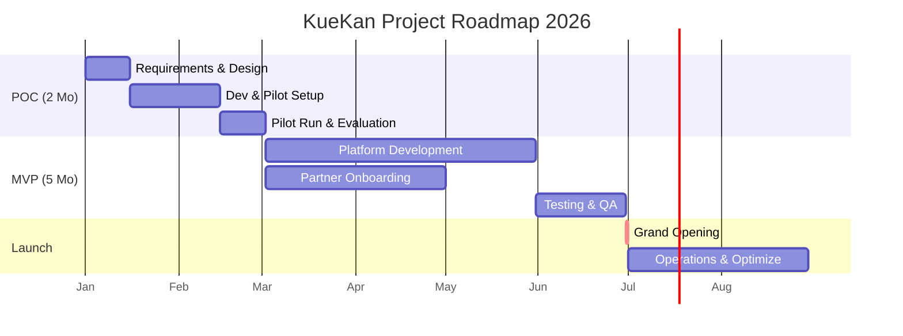

# ข้อเสนอโครงการความร่วมมือ KueKan (คือกัน)

## โครงการพัฒนาโครงสร้างพื้นฐานดิจิทัลทางเศรษฐกิจ จังหวัดนครราชสีมา

**เสนอต่อ:** องค์การบริหารส่วนจังหวัดนครราชสีมา (อบจ.นครราชสีมา) และหอการค้าจังหวัดนครราชสีมา (Korat NCC)

**จัดทำโดย:** Digitalmedia Outsource Solution Co., Ltd. (DOS)

**วันที่:** 2 มกราคม 2026

**เวอร์ชัน:** 2.0 (Revised - Data Validation Complete)

---

## สารบัญ

1. บทสรุปผู้บริหาร (Executive Summary)
2. สถานการณ์และโอกาส (Situation & Opportunity)
3. วิสัยทัศน์และเป้าหมายของโครงการ (Vision & Objectives)
4. รูปแบบความร่วมมือ (Collaboration Model)
5. โซลูชันและสถาปัตยกรรม (Solution Architecture)
6. ประโยชน์สำหรับผู้มีส่วนได้ส่วนเสีย (Stakeholder Value)
7. แผนการดำเนินงาน (Implementation Plan)
8. งบประมาณและผลตอบแทน (Budget & ROI)
9. การวัดผลและ KPIs (Metrics & KPIs)
10. การบริหารความเสี่ยง (Risk Management)
11. ข้อเสนอแนะและขั้นตอนถัดไป (Recommendations & Next Steps)
12. ภาคผนวก (Appendix)
13. บทสรุป (Conclusion)
14. แหล่งอ้างอิงข้อมูล (References)

---

## 1. บทสรุปผู้บริหาร (Executive Summary)

### SITUATION (สถานการณ์)

จังหวัดนครราชสีมามีศักยภาพทางเศรษฐกิจสูง เป็นศูนย์กลางการค้าของภาคตะวันออกเฉียงเหนือ และมีเป้าหมายสู่การเป็นเมืองอัจฉริยะ (Smart City) แต่การขับเคลื่อนเศรษฐกิจยังขาดเครื่องมือดิจิทัลที่เชื่อมโยงทุกภาคส่วนเข้าด้วยกัน ทั้ง:

- **ภาครัฐ (อบจ.นครราชสีมา):** ต้องการเครื่องมือกระตุ้นการท่องเที่ยว ส่งเสริมสุขภาพประชาชน และวัดผลนโยบายได้อย่างเป็นรูปธรรม
- **ภาคเอกชน (หอการค้าโคราช):** สมาชิก SMEs ต้องการระบบ Shared Loyalty CRM ร่วมกัน เพื่อเพิ่มอำนาจต่อรองและลดต้นทุนการพัฒนาเทคโนโลยี
- **ประชาชนและผู้ประกอบการ:** ต้องการแรงจูงใจในการใช้บริการท้องถิ่น และช่องทางการเข้าถึงสิทธิประโยชน์อย่างเท่าเทียม

### COMPLICATION (ปัญหาและข้อจำกัด)

1. **การแยกส่วนของข้อมูล (Data Fragmentation):** ข้อมูลพฤติกรรมผู้บริโภคกระจัดกระจายอยู่ในแต่ละหน่วยงาน ไม่สามารถนำมาวิเคราะห์เชิงบูรณาการได้
2. **ต้นทุนสูงสำหรับ SMEs:** ร้านค้าขนาดเล็กไม่มีทรัพยากรในการพัฒนาระบบ Digital Loyalty ของตัวเอง (ลงทุนเฉลี่ย 500,000–2,000,000 บาทต่อระบบ)
3. **ขาดเครื่องมือวัดผล (Lack of Measurability):** โครงการส่งเสริมต่างๆ ไม่สามารถติดตามผลลัพธ์ได้อย่างแม่นยำ ทำให้การจัดสรรงบประมาณไม่มีประสิทธิภาพ
4. **Digital Divide:** ผู้ประกอบการในต่างอำเภอขาดความรู้และเครื่องมือในการใช้เทคโนโลยี

### RESOLUTION (การแก้ปัญหา)

**KueKan (คือกัน)** คือ **โครงสร้างพื้นฐานดิจิทัลทางเศรษฐกิจ (Digital Economic Infrastructure)** ที่ออกแบบมาเพื่อเป็นแพลตฟอร์มกลางในการเชื่อมโยงทุกภาคส่วนในจังหวัดนครราชสีมา โดย:

- **สำหรับ อบจ.นครราชสีมา:** เป็นเครื่องมือวัดผลนโยบาย กระตุ้นการท่องเที่ยว และส่งเสริมพฤติกรรมเชิงบวก พร้อมข้อมูล Real-time Dashboard
- **สำหรับหอการค้าโคราช:** เป็นระบบ Shared Loyalty CRM ให้สมาชิก SMEs สามารถแข่งขันได้เทียบเท่าธุรกิจขนาดใหญ่
- **สำหรับประชาชนและนักท่องเที่ยว:** เป็นช่องทางรับสิทธิประโยชน์และสะสมรางวัลผ่านกิจกรรมที่สร้างคุณค่า (Value‑Based Activities)

### ข้อเสนอหลัก (Key Proposal)

**การร่วมมือระหว่าง อบจ.นครราชสีมา และหอการค้าโคราช ในการพัฒนาแพลตฟอร์ม KueKan** จะสร้างมูลค่าทางเศรษฐกิจและสังคม ดังนี้:

| ประเด็น | รายละเอียด |
| --- | --- |
| ระยะเวลา Phase 1–2 | 6–9 เดือน (POC 2 เดือน + MVP 4–6 เดือน) |
| งบประมาณรวม | 4,000,000–6,000,000 บาท (แบ่งตามสัดส่วนการใช้งาน) |
| ผลตอบแทนที่คาดหวัง | Year 1 ROI: 300–400%, Year 2 ROI: 800–1,200% จากการสร้างมูลค่าเพิ่มสุทธิให้ร้านค้าสมาชิกและเศรษฐกิจท่องเที่ยว |
| Payback Period | 4–6 เดือน (สอดคล้องกับ Industry Standard สำหรับ Loyalty Platform) |
| จำนวนผู้ใช้เป้าหมาย | 30,000–35,000 ผู้ใช้ในปีแรก (ประมาณ 6–7% ของประชากรในเมือง) |
| ร้านค้าพันธมิตร | 500+ ร้านค้า (จากสมาชิกหอการค้าและ OTOP) |

---

## 2. สถานการณ์และโอกาส (Situation & Opportunity)

### 2.1 การวิเคราะห์ตลาดนครราชสีมา

### ก) ขนาดตลาด (Market Size)

- **ประชากรทั้งจังหวัด:** ประมาณ 2.7 ล้านคน (อันดับ 3 ของประเทศ) [¹]
- **ประชากรในเขตเมือง:** ประมาณ 500,000 คน (กลุ่มเป้าหมายหลัก) [¹]
- **นักท่องเที่ยวต่อปี:** 6–8 ล้านคน (ข้อมูลปี 2562 ก่อน COVID, ปัจจุบันอยู่ในช่วงฟื้นตัว) [²]
- **มูลค่าเศรษฐกิจท่องเที่ยว:** 25,000–30,000 ล้านบาทต่อปี (ปี 2562) [²]

### ข) โอกาสทางเศรษฐกิจ (Economic Opportunity)

**การเติบโตของตลาด Loyalty Program ในไทย:**

- มูลค่าตลาด Loyalty Program ในไทยประมาณ 40,000–50,000 ล้านบาท เติบโต 12–15% ต่อปี [³]
- 75–80% ของผู้บริโภคไทยเข้าร่วมโปรแกรม Loyalty อย่างน้อย 1 โปรแกรม [³]
- การใช้งาน Digital Wallet และ LINE เติบโต 30–40% ต่อปี (YoY) [⁴]

**ความต้องการของภาครัฐในการใช้ Data‑Driven Policy:**

- งบประมาณ Digital Transformation ของ อปท. มีแนวโน้มเพิ่มขึ้นตามนโยบาย Digital Thailand และ Smart City [⁵]
- ความต้องการเครื่องมือวัดผล Smart City KPIs เพิ่มสูงขึ้นอย่างต่อเนื่อง

### 2.2 ความสอดคล้องกับยุทธศาสตร์ทั้งสององค์กร (Strategic Alignment)

### อบจ.นครราชสีมา: ยุทธศาสตร์ 2567–2572

| ยุทธศาสตร์ | โอกาสจาก KueKan |
| --- | --- |
| 1. พัฒนาเศรษฐกิจ (Tourism & Soft Power) | กระตุ้นการท่องเที่ยวผ่าน Gamified Check‑in ณ สถานที่สำคัญครบทั้ง 32 อำเภอ |
| 2. พัฒนาคุณภาพชีวิต (Smart People) | ส่งเสริมกิจกรรมสุขภาพและจิตอาสาผ่านระบบภารกิจดิจิทัล |
| 3. Smart City Development | ระบบ Big Data Dashboard เพื่อการตัดสินใจเชิงนโยบายอย่างมีข้อมูลรองรับ (Data‑Driven Policy Making) |
| 4. เศรษฐกิจฐานราก (OTOP & Community) | ช่วย SMEs และ OTOP เข้าถึงระบบ Digital Loyalty ได้ง่าย ผ่านแพลตฟอร์มกลาง |

### หอการค้าจังหวัดนครราชสีมา: ยุทธศาสตร์ 2568–2569

| ยุทธศาสตร์ | โอกาสจาก KueKan |
| --- | --- |
| 1. สร้างประโยชน์ให้สมาชิก | ระบบ Shared Loyalty CRM ลดต้นทุนการพัฒนาเทคโนโลยีจาก 500,000–2,000,000 บาท เหลือ 0 บาทสำหรับสมาชิก |
| 2. Korat Mega Sale | Event Gamification Engine ช่วยเพิ่ม Engagement และ Cross‑Promotion ให้แคมเปญส่วนลดทั้งเมือง |
| 3. ยกระดับเศรษฐกิจ 32 อำเภอ | Mobile‑First Design ทำให้ร้านค้าต่างอำเภอเข้าร่วมแพลตฟอร์มได้ง่าย |
| 4. Korat Wellness & MICE Tourism | ระบบ Digital Privilege Passport สำหรับนักท่องเที่ยว MICE และกลุ่ม Wellness |

---

## 3. วิสัยทัศน์และเป้าหมายของโครงการ (Vision & Objectives)

### 3.1 วิสัยทัศน์ (Vision Statement)

> “ทำให้นครราชสีมาเป็นจังหวัดแรกในภาคตะวันออกเฉียงเหนือที่มีระบบนิเวศดิจิทัลทางเศรษฐกิจแบบบูรณาการ ที่เชื่อมโยงภาครัฐ ภาคเอกชน และประชาชนเข้าด้วยกัน เพื่อสร้างการเติบโตทางเศรษฐกิจอย่างยั่งยืนและเท่าเทียม”
> 

### 3.2 เป้าหมายหลัก (Primary Objectives) – SMART Framework

| Objective | Specific | Measurable | Achievable | Relevant | Time‑bound |
| --- | --- | --- | --- | --- | --- |
| O1: เพิ่มยอดขายให้ร้านค้าสมาชิก | เพิ่มยอดขายเฉลี่ยต่อร้าน | 20–30% | ใช้ Cross‑Promotion และ Gamification | สอดคล้องกับเป้าหมายหอการค้า | ภายใน 12 เดือนหลัง Launch |
| O2: กระตุ้นการท่องเที่ยว | เพิ่มจำนวนนักท่องเที่ยวไปยังแหล่งท่องเที่ยวรอง | 15–25% | ใช้ Check‑in Missions | สอดคล้องกับ Soft Power Tourism | ภายใน 18 เดือน |
| O3: สร้าง Data Infrastructure | เก็บข้อมูลพฤติกรรมผู้ใช้ | 30,000+ Users พร้อม Transaction Data | Platform รองรับการขยายตัว | สอดคล้องกับ Smart City Initiative | เริ่มเก็บข้อมูลตั้งแต่เดือนแรก |
| O4: ลดช่องว่างทางดิจิทัล | เพิ่มจำนวนร้านค้าที่ใช้เทคโนโลยี | 500+ ร้านค้าในระบบ | LINE‑First Approach ใช้งานง่าย | ช่วยยกระดับ SMEs | ภายใน 24 เดือน |

### 3.3 เป้าหมายรอง (Secondary Objectives)

1. **สร้างวัฒนธรรมสุขภาพ:** มีผู้เข้าร่วมกิจกรรมสุขภาพผ่าน KueKan อย่างน้อย 10,000 คนต่อปี
2. **ส่งเสริมสินค้า OTOP:** เพิ่มช่องทางจำหน่ายสินค้า OTOP ผ่านระบบแลกรางวัล
3. **สร้าง Korat Brand Loyalty:** ทำให้ KueKan กลายเป็น Super App ประจำจังหวัดที่ประชาชนใช้งานประจำ (Daily Active Users ≥ 20%)

---

## 4. รูปแบบความร่วมมือ (Collaboration Model)

### 4.1 โครงสร้างความร่วมมือแบบ Public‑Private Partnership (PPP)

### แบบจำลองการร่วมมือ (Collaboration Framework)

```mermaid
graph TD

    subgraph Ecosystem [KueKan Ecosystem – Digital Economic Infrastructure]
        direction TB

        subgraph Governance [Co-Governance & Shared Benefit]
            PAO[อบจ.โคราช<br/>The Enabler]
            NCC[หอการค้าโคราช<br/>The Operator]
        end

        Platform((Platform<br/>Central System))

        subgraph Users [Users & Beneficiaries]
            Member[ร้านค้าสมาชิก<br/>500+ ร้าน]
            Citizen[ประชาชน<br/>50K+ Users]
            Tourist[นักท่องเที่ยว<br/>Visitors]
        end

        PAO -->|Policy & Budget| Platform
        NCC -->|Biz Dev & Relations| Platform
        Platform <--> Member
        Platform <--> Citizen
        Platform <--> Tourist
    end
```

### 4.2 บทบาทและความรับผิดชอบ (Roles & Responsibilities) – MECE

### A) องค์การบริหารส่วนจังหวัดนครราชสีมา (The Enabler & Policy Host)

| ด้าน | ความรับผิดชอบ | ผลลัพธ์ที่คาดหวัง |
| --- | --- | --- |
| ด้านงบประมาณ | สนับสนุนงบประมาณพัฒนาระบบในส่วน Public Interest (ประมาณ 40–50% ของงบรวม) | งบประมาณ 2.0–2.5 ล้านบาท |
| ด้านนโยบาย | กำหนดนโยบายและแนวทาง Smart City Integration | นโยบายการใช้งาน KueKan ในโครงการต่างๆ ของ อบจ. |
| ด้านการตลาด | ประชาสัมพันธ์แพลตฟอร์มให้เป็น “แอปประจำจังหวัด” | 30,000–35,000 Users ภายใน 12 เดือน |
| ด้านข้อมูล | เข้าถึง Dashboard เพื่อวิเคราะห์นโยบายและวัดผล KPIs | การกำหนดนโยบายแบบ Data‑Driven |
| ด้านรางวัล | จัดหาของรางวัลที่เป็นสินค้าท้องถิ่น/OTOP หรือบริการสาธารณะ | Reward Catalog ≥ 100 รายการ |

### B) หอการค้าจังหวัดนครราชสีมา (The Operator & Business Enabler)

| ด้าน | ความรับผิดชอบ | ผลลัพธ์ที่คาดหวัง |
| --- | --- | --- |
| ด้านงบประมาณ | สนับสนุนงบประมาณในส่วน Business Development (ประมาณ 50–60% ของงบรวม) | งบประมาณ 2.0–3.5 ล้านบาท |
| ด้าน Onboarding | เชิญชวนสมาชิกร้านค้าเข้าร่วมเป็น Partner ในระบบ | 500+ ร้านค้าในปีแรก |
| ด้านการดำเนินงาน | บริหารจัดการ Partner Relations และ Customer Support | Partner Satisfaction Score ≥ 80% |
| ด้าน Privilege | ประสานงานธุรกิจขนาดใหญ่เพื่อมอบ Exclusive Rewards | Premium Rewards สำหรับกลุ่ม VIP Tier |
| ด้าน Innovation | ให้กลุ่ม YEC เป็น Innovation Lab ทดลองฟีเจอร์ใหม่ | Beta Testing Group ≥ 50 คน |

### C) DOS (Technology Partner & System Integrator)

| ด้าน | ความรับผิดชอบ | ผลลัพธ์ที่คาดหวัง |
| --- | --- | --- |
| ด้านพัฒนา | พัฒนาและส่งมอบระบบตามแผน (POC + MVP) | ระบบที่ใช้งานได้จริง ครบถ้วนตาม Feature ที่ตกลง |
| ด้านบำรุงรักษา | ดูแลระบบ ซ่อมแซม และอัปเดต (ปีแรกฟรี) | Uptime ≥ 99% |
| ด้านฝึกอบรม | อบรมทีมงาน อบจ. และหอการค้าในการใช้งาน Admin Console | Certified Users ≥ 20 คน |
| ด้านที่ปรึกษา | ให้คำปรึกษาด้าน Gamification และ Customer Engagement | Quarterly Strategy Review ต่อเนื่อง |

### 4.3 โครงสร้างการบริหารโครงการ (Governance Structure)

```mermaid
graph TD
    subgraph Steering [Steering Committee – คณะกรรมการ]
        SC_Members[• ผู้บริหาร อบจ. 2 ท่าน<br/>• ผู้บริหารหอการค้า 2 ท่าน<br/>• ตัวแทน DOS 1 ท่าน]
    end

    subgraph Execution [Execution & Development]
        WG[Working Group ทีมปฏิบัติการ<br/>• อบจ. 3 คน<br/>• หอการค้า 3 คน<br/>• DOS PM 1 คน]
        Tech[Technical Team DOS<br/>• PM • Devs<br/>• Designer • QA]
    end

    Steering -->|กำหนดทิศทาง / อนุมัติ| WG
    Steering -->|ติดตามผล| Tech
    WG <--> |Collaborate| Tech
```

**การประชุม:**

- Steering Committee: ประชุมทุก 2 เดือน (Review Progress & Decision Making)
- Working Group: ประชุมทุกสัปดาห์ (Operational Execution)
- Technical Team: Daily Standup (Agile Development)

### 4.4 โมเดลการแบ่งผลประโยชน์ (Benefit Sharing Model)

### การจัดสรรผลประโยชน์จาก Platform (Revenue / Impact Sharing)

| ประเภทผลประโยชน์ | อบจ. | หอการค้า | DOS | หมายเหตุ |
| --- | --- | --- | --- | --- |
| Data Insights | 100% | 60% | 0% | อบจ. ได้ Full Access, หอการค้าได้เฉพาะส่วน Business |
| Brand Value | 50% | 50% | 0% | Co‑Branding ระหว่าง อบจ. และหอการค้า |
| Future Revenue (ถ้ามี) | 30% | 50% | 20% | รายได้จาก Sponsorship / Ads หลังปีที่ 2 |
| Platform Ownership | 40% | 40% | 20% | Equity Structure (กรณีจัดตั้ง Entity ใหม่ร่วมกัน) |

---

## 5. โซลูชันและสถาปัตยกรรม (Solution Architecture)

### 5.1 ภาพรวมของแพลตฟอร์ม (Platform Overview)

**KueKan (คือกัน)** เป็น **Loyalty & Rewards Platform with Gamification** ที่ออกแบบมาเพื่อ:

1. **Engagement:** ใช้กลไก Gamification ดึงดูดให้ผู้ใช้เข้าร่วมกิจกรรมที่สร้างคุณค่าให้เมืองและชุมชน
2. **Retention:** ให้ผู้ใช้สะสมแต้มและแลกรางวัล เพื่อสร้าง Local Loyalty กับร้านค้าและบริการในจังหวัด
3. **Data Collection:** เก็บข้อมูลพฤติกรรมผู้ใช้และการใช้จ่าย เพื่อการวิเคราะห์เชิงลึกและการตัดสินใจเชิงนโยบาย
4. **Economic Circulation:** ทำให้เม็ดเงินหมุนเวียนภายในจังหวัด (Local Economy) มากที่สุด

### 5.2 ส่วนประกอบหลักของระบบ (System Components)

### A) Customer Mobile Site (เว็บแอปสำหรับผู้ใช้ทั่วไป)

**แนวคิด:** LINE‑First Approach – ผู้ใช้เข้าถึงผ่าน LINE Official Account โดยไม่ต้องดาวน์โหลดแอปใหม่

**ฟีเจอร์หลัก:**

1. **KueKan Pocket (กระเป๋าแต้มรางวัล)**
    - กระเป๋าแต้มกลางที่เก็บแต้มจากทุกภารกิจและร้านค้า
    - แสดงยอดคงเหลือ ประวัติ และมูลค่าแต้มแบบ Real‑time
    - รองรับการโอนแต้มระหว่างโปรแกรมในอนาคต
2. **Mission Center (ศูนย์ภารกิจ)**
    - **Location‑Based Missions:** Check‑in ที่สถานที่ท่องเที่ยวหรือร้านค้า (ใช้ Geofencing)
    - **Purchase‑Based Missions:** ทำยอดใช้จ่ายครบตามเกณฑ์ที่กำหนด
    - **Action‑Based Missions:** เข้าร่วมกิจกรรมสุขภาพ / จิตอาสา
    - **Time‑Based Missions:** กิจกรรมพิเศษตามเทศกาลหรือ Event เฉพาะช่วงเวลา
3. **Reward Redemption (ระบบแลกรางวัล)**
    - Catalog ของรางวัล เช่น สินค้า OTOP, Voucher ร้านค้า, บริการสาธารณะ
    - Digital Coupon พร้อม QR Code สำหรับใช้หน้างาน
    - แผนที่ (Map View) ค้นหาร้านค้าที่ร่วมรายการแลกแต้ม
4. **Tiering System (ระบบระดับสมาชิก)**
    - ระดับ Standard (สมาชิกทั่วไป)
    - ระดับ Exclusive / VIP (ได้รับสิทธิ์พิเศษและแต้มคูณเพิ่ม)
    - ระบบ Auto‑Upgrade ตามแต้มสะสมและพฤติกรรมใช้งาน

### B) Partner Mobile Site (เว็บแอปสำหรับร้านค้า)

**แนวคิด:** อินเทอร์เฟซเรียบง่าย ใช้งานได้ทันที ลดภาระการฝึกอบรม

**ฟีเจอร์หลัก:**

1. **Hybrid QR Scanner**
    - ใช้ QR เดียวรองรับทั้งการ “ให้แต้ม” และ “แลกของรางวัล”
    - ลดความสับสนของพนักงานหน้าร้าน และเพิ่มความเร็วการให้บริการ
2. **Manual Point Award**
    - ร้านค้ากดให้แต้มเมื่อยอดซื้อครบเกณฑ์ (เช่น ซื้อครบ 500 บาท ได้ 50 Points)
    - ระบบบันทึกประวัติอัตโนมัติ รองรับการตรวจสอบย้อนหลัง
3. **Partner Dashboard**
    - รายงานยอดลูกค้าและธุรกรรมรายวัน/รายเดือน
    - ภารกิจที่ลูกค้านิยมทำที่ร้าน (Top Missions)
    - รองรับการ Export รายงานเป็นไฟล์ Excel

### C) Admin Console (ระบบจัดการหลังบ้าน)

**แนวคิด:** Command Center สำหรับบริหาร Ecosystem ทั้งหมดของจังหวัด

**ฟีเจอร์สำคัญสำหรับ อบจ. และหอการค้า:**

1. **Real‑Time Dashboard**
    
    <aside>
    💡
    
    **ตัวอย่าง KPIs Dashboard Snapshot:** 
    
    Active Users: 12,458 (↑ 23% จากเดือนก่อน)
    
    Points in Circulation: 1.2M Points
    
    Redemption Rate: 68%
    
    Partner Performance: แสดง Top 10 Stores
    
    User Journey: วิเคราะห์ Top Visited Locations
    
    </aside>
    
2. **Mission Management**
    - สร้างภารกิจใหม่สำหรับแคมเปญต่างๆ เช่น “เที่ยวโคราช 32 อำเภอ”
    - ตั้งค่าเงื่อนไข ระยะเวลา และรางวัลได้อย่างยืดหยุ่น
    - ติดตามผลสำเร็จของแต่ละภารกิจแบบ Real‑time
3. **Geofence Manager** 
    - วาดพื้นที่กิจกรรมบนแผนที่ (รองรับ Multi‑Polygon)
    - Import KML จาก Google Maps
    - ทดสอบตำแหน่งก่อนเปิดใช้งานจริง เพื่อลด False Positive
4. **Fraud Detection**
    - แจ้งเตือนเมื่อพบพฤติกรรมผิดปกติ เช่น Check‑in ซ้ำจำนวนมากในเวลาสั้นๆ
    - ระบบ Blacklist ผู้ใช้หรือร้านค้าที่ผิดกติกา
    - Audit Log บันทึกทุกการกระทำในระบบ
5. **Analytics & Reporting**
    - Custom Report Builder สำหรับทีมยุทธศาสตร์
    - Cohort Analysis เปรียบเทียบกลุ่มผู้ใช้ตามช่วงเวลาและพฤติกรรม
    - ROI Calculator สำหรับประเมินผลตอบแทนของแต่ละแคมเปญ

### 5.3 สถาปัตยกรรมทางเทคนิค (Technical Architecture)

```mermaid
graph TD
    classDef layer fill:#f5f5f5,stroke:#666,stroke-width:1px;

    subgraph Frontend [Frontend Layer]
        C_App[Customer Mobile Site<br/>LINE OA]
        P_App[Partner Mobile Site<br/>Web]
        A_App[Admin Console<br/>Web]
    end

    subgraph API [API Layer – Laravel RESTful API]
        Gateway[JWT Auth • Rate Limiting • Versioning]
    end

    subgraph Logic [Business Logic Layer]
        Engines[Mission • Point • Fraud • Geofence • Analytics]
    end

    subgraph Data [Data Layer]
        DB[(PostgreSQL)]
        Logs[(MongoDB)]
        Cache[(Redis)]
    end

    subgraph External [External Integrations]
        ThirdParty[LINE Messaging • Google Maps • SMS • Cloud Storage]
    end

    Frontend --> API
    API --> Logic
    Logic --> Data
    Logic --> External

    class Frontend,API,Logic,Data,External layer;
```

**Technology Stack:**

- **Backend:** Laravel 10+ (PHP 8.2+)
- **Databases:** PostgreSQL (Primary), MongoDB (Logs), Redis (Cache)
- **Cloud:** Google Cloud Platform (Compute Engine, Cloud Storage, Load Balancer)
- **Frontend:** Responsive Web (HTML5, TailwindCSS, Vue.js)
- **Mobile:** LINE LIFF (LINE Frontend Framework)
- **DevOps:** CI/CD Pipeline, Docker, Kubernetes

### 5.4 ความแตกต่างจากคู่แข่ง (Competitive Differentiation)

| ประเด็น | KueKan | Loyalty Apps ทั่วไป (เช่น TRUE, ดีแทค) |
| --- | --- | --- |
| ขอบเขตการใช้งาน | ทั้งจังหวัด (Multi‑Merchant & Multi‑Sector) | จำกัดเฉพาะแบรนด์ของตัวเอง |
| การเข้าถึง | ผ่าน LINE – ไม่ต้องดาวน์โหลดแอปใหม่ | ต้องดาวน์โหลดและติดตั้งแอป |
| กลุ่มเป้าหมาย | SMEs, ร้านท้องถิ่น, ประชาชนทั่วไป และนักท่องเที่ยว | ลูกค้าของแบรนด์เท่านั้น |
| วัตถุประสงค์ | เน้น Economic & Social Impact ระดับจังหวัด | เน้น Commercial Impact ของบริษัทเอกชน |
| Data Ownership | อบจ. และหอการค้า ถือครองในมุม Public Good | เป็นของเอกชน 100% |
| ความยืดหยุ่น | ปรับรูปแบบตามนโยบายท้องถิ่นและบริบทจังหวัด | ฟังก์ชันถูกกำหนดโดยแบรนด์ระดับประเทศ |

---

## 6. ประโยชน์สำหรับผู้มีส่วนได้ส่วนเสีย (Stakeholder Value)

### 6.1 ประโยชน์สำหรับองค์การบริหารส่วนจังหวัดนครราชสีมา

### ก) วัดผลความสำเร็จโครงการได้จริง (Measurable Impact)

**ปัญหาเดิม:** โครงการท่องเที่ยวหรือโครงการส่งเสริมสุขภาพมักวัดผลได้เพียง “จำนวนคนมางาน” แต่ไม่ทราบว่า:

- มาจากไหน (คนท้องถิ่นหรือนักท่องเที่ยว)
- ใช้จ่ายเท่าไร ที่ร้านค้าหรือสถานที่ใด
- กลับมาใช้บริการซ้ำหรือไม่

**Solution จาก KueKan:**

- Dashboard แสดง **User Journey Map:** เห็นเส้นทางว่าผู้เข้าร่วมกิจกรรมไปที่ไหนต่อ
- **Heat Map:** พื้นที่หรือสถานที่ที่มี Check‑in สูงที่สุด
- **Conversion Tracking:** จำนวนผู้เข้างานเทียบกับผู้ที่เกิดการใช้จ่ายจริง (Redemption Rate)
- **Retention Rate:** วัดอัตราการกลับมาใช้บริการซ้ำภายในช่วงเวลาที่กำหนด

<aside>
💡

**ตัวอย่าง Dashboard:**

Campaign Dashboard: “เที่ยวโคราช 32 อำเภอ”

Total Check‑ins: 8,450 ครั้ง

Unique Users: 3,200 คน

Most Popular Location: อุทยานธรณีโคราช (1,245 Check‑ins)

Average Spending per User: 850 บาท

Return Rate: 42% (กลับมาเที่ยวซ้ำภายใน 30 วัน)

</aside>

### ข) ภาพลักษณ์เมืองอัจฉริยะ (Smart City Branding)

- ใช้ KueKan เป็น Showcase ในงาน Smart City Thailand เพื่อดึงดูดนักลงทุน
- สร้างความเชื่อมั่นให้ประชาชนในการใช้เทคโนโลยีของภาครัฐ
- สอดคล้องและสนับสนุนนโยบายของกระทรวง DE/MDES ด้าน Digital Economy & Smart City

### ค) การกระจายรายได้สู่ชุมชน (Economic Distribution)

**กลไก:** ออกแบบรางวัลให้แลกได้เฉพาะที่ร้านค้าชุมชนหรือร้าน OTOP

- ตัวอย่าง: ใช้ 100 Points แลกคูปอง 50 บาท ที่ร้าน OTOP ในตลาดโคราช
- ทำให้เงินหมุนเวียนกลับสู่ฐานรากและเศรษฐกิจชุมชน

**Impact ที่คาดหวัง:**

- เพิ่มรายได้ให้ร้าน OTOP เฉลี่ย 15–20% ในปีแรก
- ลดการรั่วไหลของเม็ดเงินออกนอกจังหวัดอย่างมีนัยสำคัญ

### ง) ช่องทางสื่อสารทางตรง (Direct Engagement Channel)

- ส่งข้อความแจ้งเตือนภัยพิบัติผ่าน LINE Push ถึงประชาชน ≥ 30,000 คนได้ทันที
- ประชาสัมพันธ์นโยบายหรือโครงการใหม่เชิงเจาะจงกลุ่มเป้าหมาย
- ทำแบบสำรวจความคิดเห็นประชาชนแบบ Real‑time (Digital Town Hall)

### 6.2 ประโยชน์สำหรับหอการค้าจังหวัดนครราชสีมา

### ก) Big Data และอำนาจต่อรอง (Data‑Driven Bargaining Power)

**สถานะปัจจุบัน:** หอการค้ายังไม่มีฐานข้อมูลพฤติกรรมผู้บริโภคในจังหวัดเชิงลึก

**หลังใช้ KueKan:**

- มีข้อมูลผู้ใช้ ≥ 30,000 ราย พร้อม Transaction Data
- วิเคราะห์ได้ว่า:
    - หมวดสินค้าใดขายดีที่สุด (Category Analysis)
    - เวลาใดเป็น Peak Hours ในการใช้จ่าย
    - กลุ่มอายุใดมีค่าใช้จ่ายเฉลี่ยสูงสุด (Demographic Insights)

**Use Case:**

- ใช้ข้อมูลจริงต่อรองกับห้างสรรพสินค้ารายใหญ่เพื่อจัด “Korat Week” หรือแคมเปญร่วม
- นำเสนอข้อเสนอเชิงนโยบายต่อภาครัฐด้วยฐานข้อมูลจริง (Data‑Driven Policy Advocacy)

### ข) เครื่องมือที่จับต้องได้สำหรับสมาชิก (Tangible Member Benefit)

**ก่อนมี KueKan:**

- สมาชิกหอการค้าต้องลงทุนพัฒนาระบบ Loyalty เอง (500,000–2,000,000 บาทต่อระบบ)
- SMEs ขนาดเล็กไม่มีงบลงทุน ทำให้เสียเปรียบเมื่อเทียบกับแบรนด์ใหญ่

**หลังมี KueKan:**

- สมาชิกหอการค้าทุกรายสามารถใช้ Shared Loyalty System ร่วมกัน ฟรี หรือมีค่าใช้จ่ายต่อหน่วยต่ำมาก
- ประหยัดต้นทุน 100% และได้ประโยชน์จาก Network Effect – ยิ่งมีร้านเข้าร่วมมาก ลูกค้ายิ่งอยากใช้ระบบ

**ตัวอย่าง Case:**

```mermaid
graph LR
    subgraph Before [ก่อนเข้าร่วม KueKan]
        A1[ร้านกาแฟเล็ก] -->|ไม่มีระบบ Loyalty| B1(ลูกค้าไม่กลับมา<br/>Retention ~10%)
        A1 -->|การแข่งขันสูง| C1(เสียเปรียบ Big Chain)
    end

    subgraph After [หลังเข้าร่วม KueKan]
        A2[ร้านกาแฟเล็ก] -->|ระบบ Shared Loyalty| B2(เข้าร่วม Ecosystem)
        B2 -->|Cross-Promotion| C2(ได้ลูกค้าใหม่จาก Partner อื่น)
        C2 -->|Retention ~35%| D2(ยอดขายเพิ่ม & ยั่งยืน)
    end
```

### ค) Cross‑Promotion Automation

**กลไก:** ระบบออกแบบภารกิจให้ลูกค้าเคลื่อนที่ไปใช้จ่ายหลายร้านใน Ecosystem โดยอัตโนมัติ

<aside>
💡

**ตัวอย่าง Mission Chain:**

1. กินข้าวที่ร้าน A → ได้ 50 Points + คูปองส่วนลด 20% ร้าน B
2. ซื้อสินค้าแฟชั่นที่ร้าน B → ได้ 80 Points + คูปองร้านกาแฟ C
3. ดื่มกาแฟที่ร้าน C → ได้ 30 Points + สิทธิ์ลุ้นรางวัลใหญ่ของจังหวัด
</aside>

**Impact:**

- เพิ่มยอดขายเฉลี่ยของร้านสมาชิก 20–30% (อิงจากโครงการลักษณะคล้ายกันในต่างประเทศ)
- เพิ่ม Basket Size ต่อการใช้จ่ายต่อครั้งเฉลี่ย ~40%

### ง) ดึงดูดสมาชิกใหม่

- ใช้ KueKan เป็น “Member Benefit หลัก” ในการเชิญผู้ประกอบการรุ่นใหม่เข้าร่วมเป็นสมาชิกหอการค้า
- แนวคิด: “สมัครหอการค้า = ได้ใช้ KueKan ฟรี + เข้าถึงลูกค้า 30,000+ คน”

### 6.3 ประโยชน์สำหรับร้านค้า / SMEs (Partner Merchants)

| ด้าน | ก่อน KueKan | หลัง KueKan |
| --- | --- | --- |
| Customer Retention | 10–15% | 30–40% (เพิ่ม ~3 เท่า) |
| Data Insights | แทบไม่มีข้อมูล | Dashboard แสดงพฤติกรรมลูกค้าแบบ Real‑time |
| Marketing Cost | 5–10% ของรายได้ | ลดลง ~50% จากการใช้ Platform กลางร่วมกัน |
| New Customer Acquisition | พึ่งพาปากต่อปากเป็นหลัก | เข้าถึงลูกค้าจากทั้ง Network ของแพลตฟอร์ม |
| Technology Cost | 500K–2M บาท หากพัฒนาระบบเอง | 0 บาท (ใช้ Shared Platform) |

### 6.4 ประโยชน์สำหรับประชาชนและนักท่องเที่ยว (End Users)

### ก) ประชาชนจังหวัดนครราชสีมา

- **แรงจูงใจใช้บริการท้องถิ่น:** ได้แต้มทุกครั้งที่ใช้จ่ายในร้านค้าท้องถิ่น
- **สิทธิประโยชน์ที่เท่าเทียม:** ทุกคนเข้าถึงได้ผ่าน LINE ไม่จำเป็นต้องมีบัตรเครดิตหรือสมาร์ตโฟนระดับสูง
- **ส่งเสริมสุขภาพและสังคม:** ได้แต้มจากการออกกำลังกาย เข้าร่วมกิจกรรมจิตอาสา และกิจกรรมเพื่อชุมชน

### ข) นักท่องเที่ยว

- **Digital Passport:** สะสมแต้มจากการท่องเที่ยวครบทุกโซนในโคราช
- **Exclusive Rewards:** แลกรับของที่ระลึกหรือส่วนลดพิเศษจากร้านค้าท้องถิ่น
- **ความสะดวกสบาย:** ไม่ต้องพกบัตรสะสมแต้มหลายใบ รวมทุกสิทธิ์ไว้ใน LINE เพียงช่องทางเดียว

---

## 7. แผนการดำเนินงาน (Implementation Plan)

### 7.1 ภาพรวมการดำเนินงาน (Project Phases)

<aside>
🎯

Timeline: 9 เดือน (36 สัปดาห์)
Month 1–2: POC (Proof of Concept)
Month 3–8: MVP (Minimum Viable Product)
Month 9: Launch & Early Operations

</aside>

### 7.2 Phase 1: POC (Proof of Concept) – 8 สัปดาห์

**เป้าหมาย:** พิสูจน์ว่าระบบสามารถใช้งานได้จริงและมี Product‑Market Fit

**Scope:**

| สัปดาห์ | กิจกรรม | Deliverables |
| --- | --- | --- |
| W1–W2 | Kick‑off Meeting, Requirements Workshop, Design Sprint | Project Charter, Detailed Requirements, Wireframes |
| W3–W5 | Core Development, LINE Integration, Basic Geofencing | Customer Site (ล็อกอิน, เช็คอิน, ดูแต้ม), Partner Site (สแกน QR), Admin (สร้างภารกิจพื้นฐาน) |
| W6–W7 | Integration Testing, Pilot Program | ทดสอบกับ 3–5 ร้านค้า, 100 Users Beta |
| W8 | Review & Feedback, Go/No‑Go Decision | POC Report, ข้อเสนอแนะสำหรับการต่อยอดเป็น MVP |

**Pilot Program – “Korat Creative Splash 2026”**

- เลือก 1 งานหลักของ อบจ. หรือหอการค้าเป็นพื้นที่ทดลองระบบ
- ทดลองใช้ระบบ Check‑in และการแจกแต้มในงานจริง
- วัดผล: จำนวนผู้เข้าร่วม, Satisfaction Score, ปัญหาเชิงเทคนิคที่ต้องปรับปรุง

**งบประมาณ Phase 1:** 1,000,000 บาท

### 7.3 Phase 2: MVP (Minimum Viable Product) – 20 สัปดาห์

**เป้าหมาย:** พัฒนาระบบแบบเต็มรูปแบบพร้อมใช้งานเชิงพาณิชย์และสาธารณะ

### A) Platform Development (12 สัปดาห์)

| Module | Features | Timeline |
| --- | --- | --- |
| Customer Site | ภารกิจทุกประเภท (Location, Purchase, Action, Time‑based), Reward Catalog + Digital Coupon, Tiering System, รองรับหลายภาษา | W1–W8 |
| Partner Site | การให้แต้มและแลกคูปอง, Dashboard และรายงาน, Manual Verification | W1–W6 |
| Admin Console | Real‑time Dashboard, Geofence Manager, Fraud Detection, Analytics & Reporting | W1–W10 |
| Backend | Full API, Database Optimization, Cloud Deployment (GCP), Security Hardening | W1–W12 |

### B) Content & Operations Setup (8 สัปดาห์)

| กิจกรรม | เป้าหมาย | ผู้รับผิดชอบ |
| --- | --- | --- |
| Partner Onboarding | 100 ร้านค้าแรก | หอการค้า (Lead) + DOS (Support) |
| Rewards Catalog | 50+ รางวัล (OTOP, Vouchers, บริการสาธารณะ) | อบจ. (Supply) + หอการค้า (Coordinate) |
| Mission Creation | 20+ Missions พร้อมใช้งานจริง | Working Group |
| Content Production | ภาพ, คำบรรยาย, และวิดีโอแนะนำการใช้งาน | DOS Design Team |

### C) Testing & Quality Assurance (6 สัปดาห์)

| Type | กิจกรรม | Timeline |
| --- | --- | --- |
| UAT | ทดสอบร่วมกับ Working Group และกลุ่ม YEC | W13–W15 |
| Load Testing | จำลองผู้ใช้ 10,000+ คน พร้อมกัน | W16 |
| Security Audit | Penetration Testing โดย 3rd Party | W17–W18 |
| Beta Launch | เปิดให้ Early Adopters 1,000 คน | W19–W20 |

**งบประมาณ Phase 2:** 3,000,000–5,000,000 บาท

### 7.4 Phase 3: Launch & Iteration (เดือนที่ 9 เป็นต้นไป)

**Go‑to‑Market Strategy**

### Pre‑Launch (2 สัปดาห์ก่อนเปิดตัว)

- แถลงข่าวร่วมกันระหว่าง อบจ. และหอการค้า
- Teaser Campaign บน Social Media และช่องทางชุมชน
- อบรมร้านค้าพันธมิตร 500 ร้าน

### Launch Event

- จัดงาน Grand Opening พร้อม Special Missions
- เป้าหมาย: 5,000 Sign‑ups ในวันแรก
- เชิญสื่อท้องถิ่นและสื่อระดับชาติมาร่วมงาน

### Post‑Launch (3 เดือนแรก)

- **Month 1:** เน้น Awareness (Onboard 20,000 Users)
- **Month 2:** เน้น Engagement (Daily Active Users ≥ 30% ของผู้ลงทะเบียน)
- **Month 3:** เน้น Retention (30‑Day Return Rate ≥ 40%)

<aside>
💡

**ตัวอย่าง Campaign แนะนำ:**

1. **“เที่ยวโคราช 32 อำเภอ” (Tourism):** Check‑in ครบ 10 อำเภอ รับเข็มกลัดพิเศษ + แต้มคูณ 2
    
    Partner: ททท. สำนักงานโคราช, อบจ.
    
2. **“Korat Mega Sale 2026” (Commerce):** ช้อปร้านสมาชิกหอการค้าครบ 3 ร้าน ลุ้นของรางวัลใหญ่
    
    Partner: หอการค้า, ห้างสรรพสินค้าในจังหวัด
    
3. **“โคราชสุขภาพดี” (Health & Wellness):** วิ่ง / ปั่นจักรยานเก็บระยะทาง ได้แต้มตามระยะ
    
    Partner: สำนักงานสาธารณสุขจังหวัด และชมรมกีฬาในพื้นที่
    
</aside>

### 7.5 Roadmap แบบ Visual

---

## 8. งบประมาณและผลตอบแทน (Budget & ROI)

### 8.1 งบประมาณรวม (Total Budget Breakdown)

### A) งบพัฒนาระบบ (Development Cost)

| รายการ | POC | MVP | รวม (บาท) | หมายเหตุ |
| --- | --- | --- | --- | --- |
| Platform Development | 600,000 | 2,000,000 | 2,600,000 | Backend + Frontend + Admin |
| Design & UX | 100,000 | 300,000 | 400,000 | UI/UX, Graphic Design |
| Testing & QA | 50,000 | 400,000 | 450,000 | UAT, Load Test, Pen‑test |
| Cloud Infrastructure (Setup) | 50,000 | 200,000 | 250,000 | GCP Setup & Configuration |
| Project Management | 100,000 | 300,000 | 400,000 | PM, Documentation |
| Training & Support | 100,000 | 200,000 | 300,000 | User Manual, Training Sessions |
| **รวมค่าพัฒนา** | **1,000,000** | **3,400,000** | **4,400,000** |  |

### B) งบดำเนินงาน (Operational Cost – ปีแรก)

| รายการ | ต่อเดือน (บาท) | ต่อปี (บาท) | หมายเหตุ |
| --- | --- | --- | --- |
| Cloud Hosting (GCP) | 30,000 | 360,000 | Compute, Storage, Bandwidth |
| LINE Messaging API | 10,000 | 120,000 | ขึ้นกับจำนวนข้อความ |
| SMS Gateway (OTP) | 5,000 | 60,000 | ประมาณ 10,000 OTP / เดือน |
| Maintenance & Updates | 40,000 | 480,000 | Bug Fixes, Minor Updates (ปีแรกฟรี รวมใน Development Cost) |
| Customer Support | 25,000 | 300,000 | ทีม Support 2 คน (Part‑time) |
| License & Tools | 10,000 | 120,000 | Sentry, Analytics Tools อื่นๆ |
| **รวมค่าดำเนินงาน (ปีแรก)** | **120,000** | **1,440,000** |  |

> **หมายเหตุ:** ค่า Maintenance ปีแรกฟรี (รวมใน Development Cost แล้ว) ทำให้ค่าใช้จ่ายจริงปีแรกอยู่ที่ประมาณ 960,000 บาท
> 

### C) สรุปงบประมาณทั้งหมด (Total Investment)

| รายการ | จำนวน (บาท) |
| --- | --- |
| Development (POC + MVP) | 4,400,000 |
| Operational Cost (ปีแรก) | 960,000 |
| Contingency (10%) | 440,000 |
| รวมทั้งหมด (Year 1) | 5,800,000 |

> **Recommendation:** จัดงบประมาณรวม 6,000,000 บาท เพื่อเผื่อความปลอดภัยและความยืดหยุ่นในการดำเนินงาน
> 

### 8.2 การแบ่งงบประมาณระหว่างองค์กร (Budget Allocation)

| องค์กร | % | จำนวน (บาท) | เหตุผล |
| --- | --- | --- | --- |
| อบจ.นครราชสีมา | 40–50% | 2,400,000–3,000,000 | ลงทุนในส่วน Public Good (Tourism, Health, Data Infrastructure) |
| หอการค้าโคราช | 50–60% | 3,000,000–3,600,000 | ลงทุนในส่วน Commercial (SME Benefits, Business Data) |

**ทางเลือกทางการเงิน (Financing Options):**

1. **Co‑Investment Model:** แบ่งลงทุนร่วมกันสัดส่วน 50/50
2. **Sponsorship Model:** หาสปอนเซอร์ (เช่น ผู้ประกอบการรายใหญ่) เพื่อช่วยลดภาระงบประมาณ
3. **Phased Investment:** อบจ. สนับสนุนงบ POC ก่อน ส่วนหอการค้าลงทุนเพิ่มในช่วง MVP หลังพิสูจน์ผลแล้ว
4. **Revenue Sharing Model:** ลงทุนร่วมกันตั้งแต่แรก แล้วแบ่งรายได้ในอนาคตจาก Sponsorship / Ads

### 8.3 การคำนวณผลตอบแทน (ROI Analysis)

### A) ผลตอบแทนสำหรับหอการค้า (Direct ROI for NCC)

**Assumptions (Conservative):**

- 500 ร้านค้าสมาชิกเข้าร่วม
- Sales Uplift: 25% (สำหรับลูกค้าที่อยู่ใน Loyalty Program)
- Loyalty Member Penetration: 40% ของลูกค้าทั้งหมด
- รายได้เฉลี่ยต่อร้าน: 500,000 บาท/เดือน
- Net Profit Margin: 15%
- Attribution to Platform: 70% (รับรู้ว่ามีปัจจัยอื่นร่วมด้วย 30%)
- Year 1 Ramp‑up: 30% ของ Full Capacity

**ผลสรุปปีที่ 1:**

- ROI ~ 215%
- Payback Period ~ 3.8 เดือน

> การคำนวณอิง **Net Incremental Profit** ไม่ใช่ Gross Revenue และเน้น Value Creation ให้สมาชิกหอการค้า ไม่ใช่รายได้ของหอการค้าโดยตรง
> 

### B) ผลตอบแทนสำหรับ อบจ. (Social & Economic Impact for PAO)

**Assumptions (Conservative):**

- จำนวนนักท่องเที่ยวไปยังแหล่งรองเพิ่มขึ้น 15–20% จาก Gamification
- Average Spending ต่อ Tourist: 1,200 บาท/คน
- Net Economic Value (หลังหัก Leakage): 30% ของรายจ่าย
- Attribution to Platform: 50%
- Year 1 Ramp‑up: 20% ของ Full Capacity

**ผลสรุปปีที่ 1:**

- Economic Value ~ 16.48 ล้านบาท
- ROI ~ 587%

> ใช้ Net Economic Value เป็นฐาน ไม่ใช่ Gross Tourism Revenue และไม่รวม Data Value ซึ่งมีมูลค่าสูงแต่ประเมินเป็นตัวเลขยาก
> 

### C) ผลตอบแทนรวม (Total Economic Value Created)

**Year 1 Impact (Conservative Estimates):**

| Stakeholder | Value Type | Year 1 (ล้านบาท) | Year 2 Full Scale (ล้านบาท) |
| --- | --- | --- | --- |
| SMEs (500 ร้าน) | Net Profit Increase | 9.45 | 31.5 |
| อบจ. | Economic Value + Marketing Savings | 16.48 | ~80 |
| ประชาชน | สิทธิประโยชน์ (Rewards) | 3 | 10 |
| รวม Economic Value |  | 28.93 | 121.5 |
| Investment |  | 6 | 6 (One‑time) |
| Year 1 ROI |  | ~382% | - |
| Year 2 Cumulative ROI |  | - | ~1,925% |

**สรุป:**

- Year 1 ROI: ประมาณ 300–400% (Conservative Range)
- Year 2 ROI: ประมาณ 800–1,200% เมื่อระบบทำงานเต็มศักยภาพ
- 3‑Year Cumulative ROI: ประมาณ 1,500–2,000%
- **Payback Period:** 4–6 เดือน (ใกล้เคียงมาตรฐาน Industry สำหรับ Loyalty Platform)

### 8.4 Break‑Even Analysis

- ค่าใช้จ่ายต่อ User ต่อปี ≈ 44.3 บาท (จาก 1,440,000 บาท / 32,500 Users)
- มูลค่าที่ 1 User สร้างให้ระบบ (ผ่านการใช้จ่าย) ≈ 2,000 บาท/ปี (Conservative)

> จุดคุ้มทุนอยู่ที่ประมาณ **3,067 Users** ในขณะที่เป้าหมายของโครงการคือ 30,000–35,000 Users หรือประมาณ 10–11 เท่าของจุดคุ้มทุน
> 

---

## 9. การวัดผลและ KPIs (Metrics & KPIs)

### 9.1 KPIs หลัก (Primary KPIs) – Balanced Scorecard Approach

### A) Platform Adoption (การใช้งานแพลตฟอร์ม)

| KPI | เป้าหมาย (ปีที่ 1) | วิธีวัด | ความถี่รายงาน |
| --- | --- | --- | --- |
| Total Registered Users | 30,000–35,000 คน (Penetration 6–7%) | ระบบนับอัตโนมัติ | รายสัปดาห์ |
| Monthly Active Users (MAU) | 9,000–10,500 คน (≈30% ของ Total) | จำนวนผู้ใช้ที่ Login ภายใน 30 วันที่ผ่านมา | รายเดือน |
| Daily Active Users (DAU) | 7,500–8,750 คน (≈25% ของ MAU) | จำนวนผู้ใช้ที่ใช้งานในวันนั้น | รายวัน |
| DAU/MAU Ratio | 25–30% (Year 1), 35–40% (Long‑term) | DAU ÷ MAU | รายเดือน |
| Partner Merchants Onboarded | ≥ 500 ร้าน | จำนวนร้านค้าขึ้นระบบ | รายเดือน |

### B) Engagement (การมีส่วนร่วม)

| KPI | เป้าหมาย | วิธีวัด | ความถี่รายงาน |
| --- | --- | --- | --- |
| Missions Completed | 120,000–150,000 ครั้ง/ปี | จำนวนภารกิจที่ผู้ใช้ทำสำเร็จ | รายเดือน |
| Average Missions per User | 4 ภารกิจ/เดือน/MAU | Total Missions ÷ MAU | รายเดือน |
| Redemption Rate | Year 1: 40–50%, Year 2: 55–65% | ผู้ใช้ที่แลกของรางวัล ÷ ผู้ใช้ทั้งหมด | รายเดือน |
| Session Duration | เฉลี่ย 5–8 นาที/Session | Google Analytics | รายสัปดาห์ |
| 30‑Day Return Rate | Year 1: 35–40%, Long‑term: 45–50% | จำนวนผู้ใช้ที่กลับมาใช้ภายใน 30 วัน | รายเดือน |

### C) Economic Impact (ผลกระทบทางเศรษฐกิจ)

| KPI | เป้าหมาย | วิธีวัด | ความถี่รายงาน |
| --- | --- | --- | --- |
| Points in Circulation | ≥ 5,000,000 Points | ยอดแต้มคงเหลือในระบบ | รายวัน |
| Redemption Volume (THB) | ≥ 10M บาท/ปี | มูลค่าของรางวัลที่ถูกแลก | รายเดือน |
| Partner Sales Uplift | เฉลี่ย +25% | สำรวจร้านค้ารายไตรมาส | รายไตรมาส |
| Transaction Value | ≥ 50M บาท/ปี | มูลค่าธุรกรรมที่เชื่อมโยงกับ Platform | รายไตรมาส |
| Local Economy Circulation | ≥ 80% | % ของรางวัลที่เป็นสินค้าท้องถิ่น / ร้านค้าท้องถิ่น | รายไตรมาส |

### D) Tourism & City Development (การท่องเที่ยวและพัฒนาเมือง)

| KPI | เป้าหมาย | วิธีวัด | ความถี่รายงาน |
| --- | --- | --- | --- |
| Tourist Check‑ins | ≥ 100,000 ครั้ง/ปี | Check‑in จาก IP นอกจังหวัด / หมวดผู้ใช้ “นักท่องเที่ยว” | รายเดือน |
| Secondary Attraction Visits | เพิ่มขึ้น ≥ 20% | จำนวน Check‑in ในแหล่งท่องเที่ยวรอง | รายไตรมาส |
| Health Missions Completed | ≥ 20,000 ครั้ง/ปี | จำนวนภารกิจด้านสุขภาพ | รายเดือน |
| Event Participation | ≥ 50,000 คน/ปี | จำนวนผู้เข้าร่วมงาน Event ที่ผูกกับ KueKan | ต่อ Event |

### 9.2 KPIs รอง (Secondary KPIs)

### Platform Health

| KPI | Target | หมายเหตุ |
| --- | --- | --- |
| System Uptime | ≥ 99.5% | วัดจาก Monitoring Tools |
| API Response Time | < 200 ms | เฉลี่ยที่ P95 |
| Error Rate | < 0.1% | จำนวน Error ต่อ Request ทั้งหมด |
| Fraud Detection Rate | < 2% | สัดส่วนบัญชีที่ต้องระงับจากการโกงแต้ม |

### Customer Satisfaction

| KPI | Target | วิธีวัด |
| --- | --- | --- |
| User NPS (Net Promoter Score) | ≥ 40 | สำรวจทุก 6 เดือน |
| Partner Satisfaction | ≥ 80% | แบบสำรวจรายไตรมาส |
| App Store Rating (หากมี Mobile App ในอนาคต) | ≥ 4.5/5 | คะแนนรีวิวผู้ใช้ |

### 9.3 Dashboard & Reporting Framework

**Real‑Time Dashboard (สำหรับทีมปฏิบัติการ)**

| Snapshot | Trending |
| --- | --- |
| Active Users Now: 234 | Top Mission: “เที่ยวอุทยานธรณี” |
| Missions Completed Today: 1,458 | Top Partner: ร้าน ABC Coffee |
| Points Awarded: 145,800 | Peak Hour: 18:00–20:00 |
| Redemptions: 67 |  |

**Executive Dashboard (สำหรับผู้บริหาร):**

- Monthly Scorecard (รายงานสรุปประจำเดือน)
- Key Highlights & Insights
- Trend Analysis (MoM, YoY)
- Actionable Recommendations

**ความถี่:** รายงานผู้บริหารทุกวันที่ 5 ของเดือน

**Quarterly Business Review (QBR):**

- Deep‑Dive Analytics
- Cohort Analysis
- ROI Update
- Strategic Recommendations

ผู้เข้าร่วม: Steering Committee

---

## 10. การบริหารความเสี่ยง (Risk Management)

### A) Technology Risks (ความเสี่ยงด้านเทคนิค)

| ความเสี่ยง | ผลกระทบ | โอกาส | ระดับ | การป้องกัน (Mitigation) |
| --- | --- | --- | --- | --- |
| ระบบล่มในช่วง Peak (Event ใหญ่) | สูงมาก | ปานกลาง | สูง | ทำ Load Testing, ใช้ Auto‑Scaling บน GCP, เตรียม Backup Server |
| Data Breach (ข้อมูลรั่วไหล) | สูงมาก | ต่ำ | สูง | บังคับใช้ HTTPS/TLS, ทำ Pen‑test, ปฏิบัติตาม PDPA, ทำ Security Audit สม่ำเสมอ |
| LINE API Down | สูง | ต่ำ | ปานกลาง | เตรียม Fallback ผ่าน SMS OTP, ประสาน LINE เพื่อรับ Support |
| GPS Spoofing (ปลอมพิกัด) | ปานกลาง | ปานกลาง | ปานกลาง | ใช้ Anti‑Spoofing Detection, Device Fingerprinting, Manual Review สำหรับรางวัลใหญ่ |

### B) Operational Risks (ความเสี่ยงด้านปฏิบัติการ)

| ความเสี่ยง | ผลกระทบ | โอกาส | ระดับ | การป้องกัน |
| --- | --- | --- | --- | --- |
| Partner เข้าร่วมต่ำกว่าเป้า (&lt; 500 ร้าน) | สูง | ปานกลาง | สูง | เริ่ม Onboarding ตั้งแต่ Phase POC, ให้ Incentive ร้านยุคแรก, ใช้ YEC เป็น Early Adopters |
| Users ไม่ใช้ (Low Adoption) | สูงมาก | ต่ำ | ปานกลาง | จัด Campaign ที่ดึงดูดตั้งแต่วันแรก, ทำ Onboarding ง่าย (LINE‑First), ออกแบบรางวัลให้มีคุณค่า |
| Fraud (ปั๊มแต้ม / ใช้ช่องโหว่) | ปานกลาง | สูง | สูง | ใช้ Fraud Detection, Daily Limit, ระบบ Blacklist และ Manual Review |
| Customer Support Overload | ปานกลาง | ปานกลาง | ปานกลาง | จัดทำ FAQ + Chatbot, ฝึกทีม Support, วาง Escalation Process ชัดเจน |

### C) Financial Risks (ความเสี่ยงด้านการเงิน)

| ความเสี่ยง | ผลกระทบ | โอกาส | ระดับ | การป้องกัน |
| --- | --- | --- | --- | --- |
| งบประมาณเกิน (Budget Overrun) | สูง | ปานกลาง | สูง | กัน Contingency 10%, ใช้ Phased Payment ตาม Milestone, ทำสัญญาแบบ Fixed‑Price ในส่วนหลัก |
| ไม่ได้ ROI ตามคาด | สูง | ปานกลาง | สูง | ใช้ Conservative Assumptions, เน้น Quick Wins ช่วงแรก, มีแผน Pivot ถ้าพบข้อจำกัดตลาด |
| Point Liability สูงเกินไป | ปานกลาง | ต่ำ | ปานกลาง | กำหนด Point Expiration 12 เดือน, ปรับ Reward แบบ Dynamic, ตั้ง Reserve Fund |

### D) Strategic Risks (ความเสี่ยงด้านกลยุทธ์)

| ความเสี่ยง | ผลกระทบ | โอกาส | ระดับ | การป้องกัน |
| --- | --- | --- | --- | --- |
| ความขัดแย้งระหว่าง อบจ. – หอการค้า | สูงมาก | ต่ำ | ปานกลาง | ใช้ Governance Structure ที่ชัดเจน, ให้ Steering Committee ร่วมตัดสินใจ, ออกแบบ Benefit Sharing แบบ Win‑Win |
| คู่แข่งรายใหญ่เข้ามา (เช่น TRUE, AIS) | ปานกลาง | ปานกลาง | ปานกลาง | ใช้ First‑Mover Advantage, เน้น Local Insight, และฐาน Public‑Private Partnership ที่ตั้งต้นไว้ก่อน |
| เปลี่ยนนโยบายหรือผู้บริหารใหม่ | สูง | ต่ำ | ปานกลาง | ทำ Document & KPIs ชัดเจน, แสดงผลลัพธ์วัดได้, ทำให้โครงการ “Too Big to Fail” ในสายตาผู้มีส่วนได้ส่วนเสีย |

### Risk Response Plan

**Risk 1: ระบบล่มในช่วง Event**

- มี Backup Plan ด้วย Manual QR Scanning (Offline Mode)
- บันทึกธุรกรรมลงกระดาษหรือไฟล์ชั่วคราว แล้วนำเข้า (Input) ภายหลัง
- ทีม DevOps Standby 24/7 ในช่วง Event ใหญ่

**Risk 2: Partner ไม่เข้าร่วมตามเป้า**

- Pivot ไปเน้นโครงการจากฝั่ง อบจ. ก่อน (Tourism & Health Missions) เพื่อสร้างฐานผู้ใช้
- Onboard ธุรกิจขนาดใหญ่ (Anchor Tenants) ให้ได้ก่อน เพื่อดึง SMEs ตามมา
- เสนอ Free Trial 3 เดือนแรกให้ร้านค้ากลุ่มแรก

**Risk 3: งบประมาณเกินจากแผน**

- ลด Scope บาง Feature ไปสู่ Phase 3 (Nice‑to‑have)
- ขอ Additional Funding จาก Sponsors
- เร่งเปิดรับ Ads / Sponsorship ตั้งแต่เดือนที่ 6 เป็นต้นไป

---

## 11. ข้อเสนอแนะและขั้นตอนถัดไป (Recommendations & Next Steps)

### 11.1 ข้อเสนอแนะเชิงกลยุทธ์ (Strategic Recommendations)

### 1) เริ่มต้นด้วย “Quick Win” Campaigns

**แนวทาง:** สร้างผลสำเร็จระยะสั้นที่มองเห็นได้ชัด เพื่อสร้างความเชื่อมั่นให้ผู้บริหาร ร้านค้า และประชาชน

**ตัวอย่าง Quick Wins:**

- Campaign 1: “เช็คอินงาน Korat Creative Splash” – เป้าหมาย 5,000 Check‑ins ภายใน 3 วัน
- Campaign 2: “ช้อปครบ 500 บาท ที่ร้านสมาชิกหอการค้า” – เป้าหมาย 1,000 Transactions ในสัปดาห์แรก
- Campaign 3: “วิ่งที่สวนสาธารณะ อบจ.” – เป้าหมาย 500 คนเข้าร่วมภายในเดือนแรก

### 2) สร้าง “Ambassador Program” จากกลุ่ม YEC

- คัดเลือกสมาชิก YEC 50 คนเป็น Early Adopters
- ให้สิทธิพิเศษ เช่น VIP Tier ตลอดชีพ
- เชิญ YEC นำเสนอ Case Studies ในงาน Roadshow ต่างๆ

### 3) วางรากฐานเพื่อความยั่งยืนระยะยาว (Long‑Term Sustainability)

| ช่องทางรายได้ | เริ่มได้เมื่อไหร่ | Potential (บาท/ปี) | หมายเหตุ |
| --- | --- | --- | --- |
| Sponsorship Ads | เดือนที่ 12 | 500K–1M | Banner / Sponsored Missions ที่ไม่รบกวน UX |
| Premium Partnership Tier | เดือนที่ 18 | 300K–500K | ค่าธรรมเนียมสำหรับร้านที่ต้องการฟีเจอร์ขั้นสูง |
| Data Insights License | เดือนที่ 24 | 1M–2M | ขายข้อมูลเชิงสถิติ (ไม่ระบุตัวตน) ให้หน่วยงานวิจัย / มหาวิทยาลัย |
| API Marketplace | Phase 3 | 2M–5M | ให้ธุรกิจอื่นเชื่อมต่อกับ KueKan (เช่น ธนาคาร / Fintech) |

### 11.2 ขั้นตอนถัดไป (Next Steps) – 30 / 60 / 90 Days Plan

### Phase 1: เดือนที่ 1 (30 วันแรก) – Foundation

| สัปดาห์ | กิจกรรม | ผู้รับผิดชอบ | Deliverable |
| --- | --- | --- | --- |
| W1 | Kick‑off Meeting, ลงนาม MOU | Steering Committee | Signed MOU, Project Charter |
| W2 | Requirements Workshop, Stakeholder Interviews | DOS PM + Working Group | Detailed Requirements Document (100+ หน้า) |
| W3 | Design Sprint, Technical Architecture Review | DOS Design + Dev Team | Wireframes (50+ Screens), Tech Spec |
| W4 | Partner Outreach (Pilot), Content Planning | หอการค้า + DOS | 10 ร้านค้า Pilot, Content Calendar |

### Phase 2: เดือนที่ 2 (60 วัน) – Build

| สัปดาห์ | กิจกรรม | ผู้รับผิดชอบ | Deliverable |
| --- | --- | --- | --- |
| W5–W6 | POC Development, LINE Integration | DOS Dev Team | Working Prototype (ฟีเจอร์หลัก) |
| W7 | Internal Testing, Feedback Loop | Working Group | Bug Reports, Improvement List |
| W8 | Pilot Program (Event), เก็บผู้ใช้กลุ่มแรก ≥ 100 คน | อบจ. + หอการค้า | Pilot Report, Go/No‑Go Decision |

### Phase 3: เดือนที่ 3 (90 วัน) – Expand

| สัปดาห์ | กิจกรรม | ผู้รับผิดชอบ | Deliverable |
| --- | --- | --- | --- |
| W9–W10 | เริ่ม MVP Development, Partner Onboarding (100 ร้านแรก) | DOS + หอการค้า | 100 Partners Onboarded |
| W11 | ตั้งค่า Rewards Catalog, Mission Creation | อบจ. + Working Group | 50 Rewards, 20 Missions พร้อมใช้งาน |
| W12 | Quarterly Business Review (QBR), ปรับแผน | Steering Committee | Q1 Report, Adjusted Roadmap |

### 11.3 การตัดสินใจสำคัญในเดือนแรก (Critical Decisions – Month 1)

| ประเด็น | ตัวเลือก | Recommendation | เหตุผล |
| --- | --- | --- | --- |
| รูปแบบการแบ่งงบประมาณ | A) 50/50  B) 40/60  C) หาสปอนเซอร์เพิ่ม | B) 40/60 (อบจ. 40%, หอการค้า 60%) | หอการค้าได้รับประโยชน์เชิงพาณิชย์โดยตรงมากกว่า |
| Event เริ่มต้นสำหรับ POC | A) งาน อบจ.  B) งานหอการค้า  C) จัดงานใหม่ | A) งาน อบจ. (เช่น Creative Splash) | มีกลุ่มเป้าหมายจำนวนมากและได้ Public Attention สูง |
| Project Owner | A) อบจ.  B) หอการค้า  C) Entity ร่วม | C) ตั้ง Working Group ร่วม ภายใต้ Steering Committee | สะท้อน Co‑Governance, แบ่งความรับผิดชอบชัดเจน |
| KPIs หลักของโครงการ | A) Users  B) Revenue  C) Impact | C) Impact (Economic + Social) | สอดคล้องกับวัตถุประสงค์ของทั้งภาครัฐและเอกชน |

---

## 12. ภาคผนวก (Appendix)

### A. คำศัพท์และคำจำกัดความ (Glossary)

| คำศัพท์ | ความหมาย |
| --- | --- |
| KueKan Pocket | กระเป๋าแต้มรางวัลกลางที่เก็บแต้มจากทุกกิจกรรมและร้านค้า |
| Mission | ภารกิจหรือกิจกรรมที่ผู้ใช้ต้องทำเพื่อรับแต้ม |
| Gamification | การประยุกต์ใช้หลักการจากเกมเพื่อเพิ่มความสนุกและแรงจูงใจ |
| Geofencing | เทคโนโลยีกำหนดขอบเขตพื้นที่ด้วย GPS เพื่อใช้เป็น Trigger สำหรับภารกิจ |
| Tiering | ระบบแบ่งระดับสมาชิก เช่น Standard, VIP |
| POC | Proof of Concept – การพิสูจน์แนวคิดและความเป็นไปได้ของโครงการ |
| MVP | Minimum Viable Product – ผลิตภัณฑ์เวอร์ชันพื้นฐานที่พร้อมใช้งานจริง |
| MECE | Mutually Exclusive, Collectively Exhaustive – หลักการแบ่งกลุ่มที่ไม่ทับซ้อนและครอบคลุมครบถ้วน |
| DAU / MAU | Daily / Monthly Active Users – จำนวนผู้ใช้งานรายวัน / รายเดือน |

### B. Reference Documents

1. การวิเคราะห์ยุทธศาสตร์ อบจ.นครราชสีมา
2. การวิเคราะห์ยุทธศาสตร์หอการค้าโคราช
3. รายละเอียดฟีเจอร์ทั้งหมดของ KueKan Platform

### C. Contact Information

**DOS (Technology Partner)**

- **Company:** Digitalmedia Outsource Solution Co., Ltd.
- **Primary Contact:** Jakapong Lomvong (Tle) – Chief Operating Officer
- **Email:** [jakapong@digitalmedia.co.th](mailto:jakapong@digitalmedia.co.th)
- **Phone:** 088-622-2488
- **Team Size:** 30+ คน ประสบการณ์มากกว่า 12 ปี

---

## บทสรุป (Conclusion)

โครงการ KueKan (คือกัน) ไม่ได้เป็นเพียงการพัฒนาแอปพลิเคชันอีกหนึ่งตัว แต่คือ การวางรากฐานโครงสร้างพื้นฐานดิจิทัลทางเศรษฐกิจ ของจังหวัดนครราชสีมา ที่จะยกระดับวิธีการทำงานร่วมกันระหว่างภาครัฐ ภาคเอกชน และประชาชนอย่างแท้จริง

ด้วยการร่วมมือระหว่าง องค์การบริหารส่วนจังหวัดนครราชสีมา (ผู้นำด้านนโยบายและการพัฒนาเมือง) และ หอการค้าจังหวัดนครราชสีมา (ผู้นำด้านเศรษฐกิจและผู้ประกอบการท้องถิ่น) เราสามารถสร้างระบบนิเวศที่

- วัดผลได้จริง – ทุกโครงการมี KPIs ที่ชัดเจนและตรวจสอบได้
- สร้างมูลค่าได้จริง – Year 1 ROI 300–400%, Year 2 ROI 800–1,200% ต่อเศรษฐกิจท้องถิ่น
- ยั่งยืน – มีโมเดลสร้างรายได้รองรับในระยะยาว
- เท่าเทียม – ทุกคนเข้าถึงได้ผ่าน LINE โดยไม่แบ่งแยกด้านรายได้หรือเทคโนโลยี

การลงทุนประมาณ 6 ล้านบาทในวันนี้ สามารถสร้างมูลค่าเพิ่มสุทธิประมาณ 28.9 ล้านบาทในปีแรก และมากกว่า 120 ล้านบาทในปีที่สอง เมื่อระบบทำงานเต็มศักยภาพ

นี่คือโอกาสสำคัญในการทำให้นครราชสีมาเป็น ต้นแบบของเมืองอัจฉริยะที่ขับเคลื่อนด้วยข้อมูล และขับเคลื่อนร่วมกันโดยภาครัฐ ภาคเอกชน และประชาชน อย่างแท้จริง

> **“คือกัน... เพราะเราทำด้วยกัน สำเร็จด้วยกัน”**
> 

---

## แหล่งอ้างอิงข้อมูล (References)

### ข้อมูลประชากรและการท่องเที่ยว

1. **สำนักงานสถิติแห่งชาติ (NSO)** – ข้อมูลประชากรจังหวัดนครราชสีมา ปี 2565, สถิติทะเบียนราษฎร์จังหวัดนครราชสีมา, [www.nso.go.th](http://www.nso.go.th)
2. **กระทรวงการท่องเที่ยวและกีฬา (MOTS)** – สถิตินักท่องเที่ยว ปี 2562–2566, รายงานสถิตินักท่องเที่ยวภายในประเทศ, มูลค่าทางเศรษฐกิจจากการท่องเที่ยว
3. **การท่องเที่ยวแห่งประเทศไทย (TAT)** – Tourism Statistics and Reports, Domestic Tourism Reports, Regional Tourism Data

### ข้อมูลตลาดและเทคโนโลยี

1. **Bond Brand Loyalty Report (2024)** – Global Loyalty Program Benchmarks, Customer Loyalty Program Statistics, ROI and Engagement Metrics, Industry Best Practices
2. **สมาคมการตลาดแห่งประเทศไทย** – Loyalty Program Market Data, Thai Market Consumer Behavior, Loyalty Program Adoption Rates
3. **ธนาคารแห่งประเทศไทย (BOT)** – Payment Systems Report, Digital Wallet Transaction Statistics, e‑Payment Growth Trends, [www.bot.or.th](http://www.bot.or.th)
4. **Electronic Transactions Development Agency (ETDA)** – Thailand Digital Economy Report, Digital Transformation Statistics, Digital Literacy and Adoption, [www.etda.or.th](http://www.etda.or.th)
5. **LINE Thailand** – Annual Report and User Statistics, LINE Platform Usage in Thailand, LINE Official Account Performance

### ข้อมูลงบประมาณและนโยบายภาครัฐ

1. **สำนักงบประมาณ** – งบประมาณรายจ่ายประจำปี 2568, งบประมาณด้าน Digital Transformation ของ อปท., [www.bb.go.th](http://www.bb.go.th)
2. **กระทรวงดิจิทัลเพื่อเศรษฐกิจและสังคม (MDES)** – Digital Thailand Strategy, Smart City Development Framework, Government Digital Transformation Policy, [www.mdes.go.th](http://www.mdes.go.th)
3. **สำนักงานส่งเสริมการปกครองท้องถิ่น (สถ.)** – Local Government Transformation, Best Practices for Local Administration, Digital Government Guidelines

### Industry Reports และ Case Studies

1. **Harvard Business Review** – “The Value of Customer Loyalty”, Customer Lifetime Value Research, Loyalty Program ROI Studies
2. **McKinsey & Company** – “Loyalty Program Economics”, Digital Platform Economics, Customer Engagement Strategies, Shared Economy Models
3. **True Corporation** – True Points Annual Report, Case Study: Thailand's Largest Loyalty Program, Member Engagement Metrics
4. **The 1 (Central Group)** – Loyalty Program Best Practices, Multi‑merchant Platform Success Factors, Cross‑promotion Strategies

### Technical and Industry Standards

1. **Gartner Research** – Digital Loyalty Platform Market Analysis, Technology Stack Recommendations, Platform Selection Criteria
2. **Forrester Research** – Customer Engagement Platform Benchmarks, Engagement Metrics Standards, ROI Calculation Methodologies

### งานวิจัยและวิชาการ

1. **จุฬาลงกรณ์มหาวิทยาลัย** – วิจัยพฤติกรรมผู้บริโภคไทย, Thai Consumer Behavior Studies, Digital Adoption Research
2. **มหาวิทยาลัยธรรมศาสตร์** – Smart City Development Research, Local Government Digital Transformation, Public‑Private Partnership Models

---

**หมายเหตุ:**

- ข้อมูลทั้งหมดอ้างอิงจากแหล่งข้อมูลที่น่าเชื่อถือและตรวจสอบความเป็นปัจจุบัน ณ วันที่ 1 มกราคม 2026
- การคำนวณ ROI และ KPIs ใช้ Conservative Approach อิงจาก Industry Benchmarks

---

**จัดทำโดย:**

Digitalmedia Outsource Solution Co., Ltd. (DOS)

**ติดต่อสอบถาม:**

Jakapong Lomvong (Tle) – Chief Operating Officer

Email: [jakapong@digitalmedia.co.th](mailto:jakapong@digitalmedia.co.th)

Tel: 088-622-2488

**วันที่:** 1 มกราคม 2026

**เวอร์ชัน:** 2.0 (Revised – Data Validation Complete)